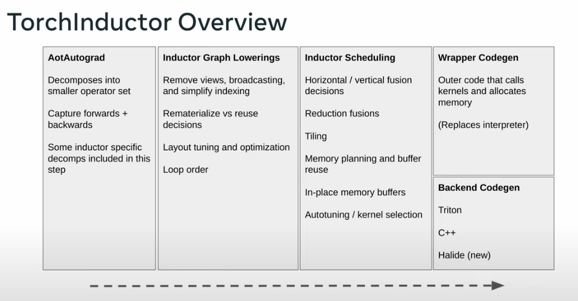

# PyTorch 2.x and Backends

**Disclaimer**: Human "generated" text as a labor of love.

## The Great ML Framework Debate
Centuries ago (2020), I contributed to PyTorch library, specifically, TorchServe which used to be the default model serving library for PyTorch Models.

Back then the ML Frameworks were split into two factions:
* Eager Mode
* Graph Mode


Graph Mode was a strict programming model which required the models to be expressible as compute DAGs. With each node of the graph expresed as a single operation whose inputs and outputs were statically sized. This made life easier for the frameworks to optimize with a compiler since graph optimizations are readily achievable offline in comparison to dynamic shapes. This can be seen as _analogous to programming in statically typed languages such as C/C++_. ML Frameworks in question are TensorFlow 1.x, MxNet etc

Eager Mode was easier to code and debug with. Preferred by users who just wanted to get on with it. If you are concerned more with the outcome of the model you are building then this is how you would be thinking. It was _analogous to programming with Python._ PyTorch was the flagbearer for this eager mode, funnily enough MxNet also supported this.

## PyTorch - Graph Modes
PyTorch wanted in, so they made all these different attempts at also becoming a Graph Mode Execution Framework.
* `torch.jit.trace`
* `torch.jit.script`
* `Lazy Tensors`

But the users were not interested.

## PyTorch Compile

In PyTorch 2.x, we have the option to compile the model and make faster where we can.
In the sense, not all parts of the model can be captured as a graph but whatever can be captured can be optimized.

```python
# model is your model torch.nn.Module

compiled_model = torch.compile(model, backend="inductor", mode="max-autotune", dynamic=True)
```


This script tests the dynamic compilation feature of PyTorch with a large tensor.
It uses the `torch.compile` decorator to compile a function that computes
the sine and cosine of a tensor, and then calls this function with a large tensor
on a CUDA device.

### TorchDynamo:
Graph Capture for PyTorch inside `torch.compile`

### TorchInductor:
Default compiler backend for PyTorch.

### Defining Custom Backend For `torch.compile()`
In Tesla Autopilot, we use a custom ASIC / Inference Computer on-board. We always wanted to define a backend so the model's compilation stack could be abstracted away from the Model Developers. But the constraints of the hardware required us to do operations (model partitioning, sometimes, by hand) which were done better when compiled statically offline.

Here, we will see how a simple user-defined backend would look.
In a real world backend, these sample inputs will be used to implement optimizations.
Again, notice that optimizations are possible only when input shapes and sizes are known.

```python
from typing import List
import torch

def my_compiler(gm: torch.fx.GraphModule,
                sample_inputs: List[torch.Tensor]):
    print("my_compiler() called with FX graph:")
    gm.graph.print_tabular()
    return gm # returns a callable

@torch.compile(backend=my_compiler)
def toy_example(a, b):
    x = a / (torch.abs(a) + 1)
    if b.sum() < 0:
        b = b * -1
    return x * b

for _ in range(1000):
    toy_example(torch.randn(10), torch.randn(10))

```


```python
from typing import List
import torch

def my_compiler(gm: torch.fx.GraphModule,
                sample_inputs: List[torch.Tensor]):
    print("my_compiler() called with FX graph:")
    gm.graph.print_tabular()
    return gm # returns a callable

@torch.compile(backend=my_compiler)
def toy_example(a, b):
    x = a / (torch.abs(a) + 1)
    if b.sum() < 0:
        b = b * -1
    return x * b

for _ in range(1000):
    toy_example(torch.randn(10), torch.randn(10))
```

```
my_compiler() called with FX graph:
opcode         name    target                                                  args         kwargs
-------------  ------  ------------------------------------------------------  -----------  --------
placeholder    l_a_    L_a_                                                    ()           {}
placeholder    l_b_    L_b_                                                    ()           {}
call_function  abs_1   <built-in method abs of type object at 0x7fdce4beff00>  (l_a_,)      {}
call_function  add     <built-in function add>                                 (abs_1, 1)   {}
call_function  x       <built-in function truediv>                             (l_a_, add)  {}
call_method    sum_1   sum                                                     (l_b_,)      {}
call_function  lt      <built-in function lt>                                  (sum_1, 0)   {}
output         output  output                                                  ((x, lt),)   {}


my_compiler() called with FX graph:
opcode         name    target                   args         kwargs
-------------  ------  -----------------------  -----------  --------
placeholder    l_b_    L_b_                     ()           {}
placeholder    l_x_    L_x_                     ()           {}
call_function  b       <built-in function mul>  (l_b_, -1)   {}
call_function  mul_1   <built-in function mul>  (l_x_, b)    {}
output         output  output                   ((mul_1,),)  {}


my_compiler() called with FX graph:
opcode         name    target                   args          kwargs
-------------  ------  -----------------------  ------------  --------
placeholder    l_x_    L_x_                     ()            {}
placeholder    l_b_    L_b_                     ()            {}
call_function  mul     <built-in function mul>  (l_x_, l_b_)  {}
output         output  output                   ((mul,),)     {}
```

Let's break this down:

Our `toy_example` function is basically being run with of two tensors of 10 random values each. The function as simple as it is, can be broadly divided into three parts:

```
COMPUTE 1

IF COND:
    COMPUTE 2

COMPUTE 3
```

The three graphs printed in tabular form are actually just these `COMPUTE1, COMPUTE2, COMPUTE3`.




```python
import torch
print(torch.__version__)
```

    2.6.0+cu124


```python
import os
os.environ['TORCH_COMPILE_DEBUG'] = '1'
import torch

@torch.compile(dynamic=True)
def foo(x):
    y = x.sin()
    z = y.cos()
    return y, z

foo(torch.randn([8192, 8192], device='cuda'))
```

    /home/mlaidev/software/jsr_gdm/.venv/lib/python3.13/site-packages/torch/utils/_config_module.py:342: UserWarning: Skipping serialization of skipfiles_inline_module_allowlist value {}
      warnings.warn(
    W0526 09:03:48.447000 189635 /home/mlaidev/software/jsr_gdm/.venv/lib/python3.13/site-packages/torch/_inductor/debug.py:435] [1/0] model__1_inference_1 debug trace: /home/mlaidev/software/jsr_gdm/pytorch_backend/torch_compile_debug/run_2025_05_26_09_03_06_493183-pid_189635/torchinductor/model__1_inference_1.1


    (tensor([[-0.5081,  0.8742, -0.7563,  ...,  0.7116,  0.6417,  0.8982],
             [-0.1069, -0.9184, -0.6707,  ..., -0.3978, -0.6187,  0.8878],
             [ 0.6196, -0.6739, -0.4469,  ...,  0.7490, -0.9443,  0.7898],
             ...,
             [ 0.8925, -0.9631, -0.9991,  ...,  0.3309, -0.1943, -0.1613],
             [-0.9386, -0.8649, -0.9941,  ...,  0.4611, -0.2239,  0.1002],
             [ 0.6346, -0.2102,  0.8530,  ..., -0.9979, -0.7121, -0.8892]],
            device='cuda:0'),
     tensor([[0.8737, 0.6416, 0.7274,  ..., 0.7573, 0.8011, 0.6230],
             [0.9943, 0.6071, 0.7834,  ..., 0.9219, 0.8146, 0.6312],
             [0.8141, 0.7814, 0.9018,  ..., 0.7324, 0.5863, 0.7040],
             ...,
             [0.6274, 0.5709, 0.5410,  ..., 0.9458, 0.9812, 0.9870],
             [0.5909, 0.6487, 0.5453,  ..., 0.8956, 0.9750, 0.9950],
             [0.8053, 0.9780, 0.6577,  ..., 0.5421, 0.7570, 0.6300]],
            device='cuda:0'))


```python
!ls  /home/mlaidev/software/jsr_gdm/pytorch_backend/torch_compile_debug/run_2025_05_26_09_03_06_493183-pid_189635/torchinductor/model__1_inference_1.1
```

    fx_graph_readable.py  fx_graph_transformed.py  ir_pre_fusion.txt
    fx_graph_runnable.py  ir_post_fusion.txt       output_code.py


### Understanding the Debug Output Files

Each of these files provides a window into a different stage of the compilation pipeline:

| File | Purpose |
|------|---------|
| `fx_graph_readable.py` | Human-readable FX graph showing ATen ops |
| `fx_graph_runnable.py` | Standalone executable version of the graph |
| `fx_graph_transformed.py` | Graph after intermediate transformations |
| `ir_pre_fusion.txt` | TorchInductor IR before fusion optimizations |
| `ir_post_fusion.txt` | IR after operator fusion |
| `output_code.py` | Final generated code (Triton for GPU, C++ for CPU) |

#### fx_graph_readable.py

This file shows how your PyTorch operations are decomposed into lower-level ATen operations. For our `sin().cos()` example, you'd see something like:

```python
def forward(self, arg0_1: "f32[s0, s1]"):
    # arg0_1: "f32[s0, s1]"
    sin: "f32[s0, s1]" = torch.ops.aten.sin.default(arg0_1);  arg0_1 = None
    cos: "f32[s0, s1]" = torch.ops.aten.cos.default(sin)
    return (sin, cos)
```

Notice the symbolic shapes `s0, s1` — this is because we compiled with `dynamic=True`.

#### ir_pre_fusion.txt and ir_post_fusion.txt

These files reveal TorchInductor's intermediate representation. The IR is a "define-by-run loop level IR" with roughly ~50 operators. The key insight here is watching operations get fused.

**Pre-fusion**: Each operation is separate
```
buf0: SchedulerNode(ComputedBuffer)
buf0.writes = [MemoryDep('buf0', c0, {c0: 67108864})]
buf0.reads = [MemoryDep('arg0_1', c0, {c0: 67108864})]
# sin operation

buf1: SchedulerNode(ComputedBuffer)
buf1.writes = [MemoryDep('buf1', c0, {c0: 67108864})]
buf1.reads = [MemoryDep('buf0', c0, {c0: 67108864})]
# cos operation
```

**Post-fusion**: Operations are merged
```
buf0_buf1_fused: SchedulerNode(FusedSchedulerNode)
# Both sin and cos fused into single kernel
```

This fusion is the core optimization — instead of:
1. Read tensor from global memory
2. Compute sin, write to global memory
3. Read result from global memory
4. Compute cos, write to global memory

We get:
1. Read tensor from global memory
2. Compute sin (keep in registers)
3. Compute cos
4. Write both results to global memory

This reduces memory traffic significantly.

#### output_code.py — The Generated Triton Kernel

This is where the magic happens. For GPU targets, TorchInductor generates Triton code:

```python
@triton.jit
def triton_poi_fused_cos_sin_0(in_ptr0, out_ptr0, out_ptr1, xnumel, XBLOCK: tl.constexpr):
    xoffset = tl.program_id(0) * XBLOCK
    xindex = xoffset + tl.arange(0, XBLOCK)[:]
    xmask = xindex < xnumel
    x0 = xindex
    tmp0 = tl.load(in_ptr0 + (x0), xmask)
    tmp1 = tl.sin(tmp0)
    tmp2 = tl.cos(tmp1)
    tl.store(out_ptr0 + (x0), tmp1, xmask)
    tl.store(out_ptr1 + (x0), tmp2, xmask)
```

Notice how both `sin` and `cos` are computed in a single kernel (`fused_cos_sin`). The `poi` prefix stands for "pointwise" — indicating this is an element-wise operation.

---

## Deep Dive: The TorchDynamo + TorchInductor Pipeline

Now that we've seen the debug output, let's understand the full compilation stack:

```
┌─────────────────────────────────────────────────────────────────┐
│                     User Python Code                             │
│                  @torch.compile(backend="inductor")              │
└─────────────────────────────────────────────────────────────────┘
                              │
                              ▼
┌─────────────────────────────────────────────────────────────────┐
│                      TorchDynamo                                 │
│  • Hooks into CPython's frame evaluation (PEP 523)               │
│  • Rewrites bytecode to extract PyTorch ops                      │
│  • Creates FX Graph + Guards + Residual Bytecode                 │
└─────────────────────────────────────────────────────────────────┘
                              │
                              ▼
┌─────────────────────────────────────────────────────────────────┐
│                       FX Graph                                   │
│  • ATen operations in graph form                                 │
│  • Symbolic shapes for dynamic compilation                       │
└─────────────────────────────────────────────────────────────────┘
                              │
                              ▼
┌─────────────────────────────────────────────────────────────────┐
│                     TorchInductor                                │
│  1. Graph Lowering → Convert FX nodes to Inductor IR             │
│  2. Scheduling → Determine fusion opportunities                  │
│  3. Fusion → Merge compatible operations                         │
│  4. Code Generation → Emit Triton (GPU) or C++ (CPU)             │
└─────────────────────────────────────────────────────────────────┘
                              │
                              ▼
┌─────────────────────────────────────────────────────────────────┐
│                    Triton Compiler                               │
│  • Compiles Triton DSL to PTX assembly                           │
│  • Handles memory coalescing, tiling, shared memory              │
└─────────────────────────────────────────────────────────────────┘
                              │
                              ▼
┌─────────────────────────────────────────────────────────────────┐
│                     CUDA Driver                                  │
│  • JIT compiles PTX to SASS (device code)                        │
│  • Executes on GPU                                               │
└─────────────────────────────────────────────────────────────────┘
```

### TorchDynamo: Graph Capture via Bytecode Rewriting

TorchDynamo is remarkably clever. It doesn't require you to change your code or use a special tracing mode. Instead, it:

1. **Intercepts Python Execution**: Using CPython's PEP 523 frame evaluation hooks
2. **Analyzes Bytecode**: Identifies sequences of PyTorch operations
3. **Extracts FX Graphs**: Converts operation sequences into compilable graphs
4. **Handles Control Flow**: Creates "graph breaks" when it encounters unsupported Python features

The key innovation is the **guard system**. When Dynamo compiles a graph, it also generates guards — conditions that must be true for the compiled graph to be valid:

```python
# Example guards (conceptual)
guards = [
    tensor.dtype == torch.float32,
    tensor.device == cuda:0,
    tensor.ndim == 2,
    tensor.size(0) == 8192,  # or symbolic if dynamic=True
    tensor.requires_grad == False,
]
```

If any guard fails on subsequent calls, Dynamo recompiles.

### Graph Breaks: When Dynamo Can't Continue

Remember our `toy_example` with the `if` statement? That's a graph break. Dynamo creates multiple subgraphs:

```python
def toy_example(a, b):
    x = a / (torch.abs(a) + 1)  # Graph 1
    if b.sum() < 0:             # Graph break (data-dependent control flow)
        b = b * -1              # Graph 2 (taken branch)
    return x * b                # Graph 3
```

Each graph is compiled separately, with "resume functions" handling the transitions.

### TorchInductor: From FX Graph to Optimized Kernels

TorchInductor has lowerings for **433 PyTorch operators** (1605 including overloads). The lowering process converts high-level ATen ops to Inductor's loop-level IR.

#### The Scheduler and Fusion

The `Scheduler` class determines which operations can be fused. Fusion scoring considers:

1. **Fusion category**: pointwise, reduction, or template operations
2. **Memory traffic**: estimated bytes of read/write operations
3. **Compatibility**: operations must have compatible iteration domains

```python
# Conceptual fusion decision
def score_fusion(node1, node2):
    if not compatible_iteration_domain(node1, node2):
        return -inf
    memory_saved = estimate_memory_traffic_reduction(node1, node2)
    return fusion_category_score + memory_saved
```

#### Why Fusion Matters

Consider computing `y = relu(x @ W + b)`:

**Without fusion** (3 kernels):
```
Kernel 1: matmul      → read x, W, write temp1
Kernel 2: add bias    → read temp1, b, write temp2
Kernel 3: relu        → read temp2, write y
```
Memory traffic: ~6 tensor reads/writes

**With fusion** (1-2 kernels):
```
Kernel 1: matmul      → read x, W, write temp1
Kernel 2: add+relu    → read temp1, b, write y (fused)
```
Memory traffic: ~4 tensor reads/writes

For large tensors, this memory bandwidth reduction is substantial.

---

## Compilation Modes

`torch.compile` offers several compilation modes:

```python
# Default: balance between compile time and runtime performance
torch.compile(model)

# Reduce overhead: minimize Python overhead, slightly less optimization
torch.compile(model, mode="reduce-overhead")

# Maximum autotune: try many kernel configurations, longer compile time
torch.compile(model, mode="max-autotune")

# Maximum autotune without CUDA graphs
torch.compile(model, mode="max-autotune-no-cudagraphs")
```

### max-autotune Mode

This mode enables:
- Triton-based matrix multiplication autotuning
- CUDA graphs by default (batches multiple kernel launches)
- Extended search over kernel configurations

The tradeoff is significantly longer compilation time for better runtime performance.

---

## Practical Tips

### When to Use torch.compile

✅ **Good candidates**:
- Inference workloads with consistent input shapes
- Training loops after warmup
- Models with many element-wise operations (benefits from fusion)

⚠️ **Be careful with**:
- Highly dynamic control flow
- Constantly changing input shapes (causes recompilation)
- Very small tensors (kernel launch overhead dominates)

### Debugging Compilation Issues

```python
import torch._dynamo as dynamo

# See what's happening
dynamo.config.verbose = True

# Get explanation of graph breaks
torch._dynamo.explain(model)(sample_input)

# Disable compilation for debugging
torch._dynamo.config.suppress_errors = True
```

### Reducing Recompilation

```python
# Use dynamic shapes to avoid recompilation on shape changes
compiled_model = torch.compile(model, dynamic=True)

# Or mark specific dimensions as dynamic
torch._dynamo.mark_dynamic(tensor, dim=0)
```

---

## References

- [PyTorch 2.x Official Documentation](https://pytorch.org/get-started/pytorch-2-x/)
- [TorchDynamo Overview](https://docs.pytorch.org/docs/stable/user_guide/torch_compiler/torch.compiler_dynamo_overview.html)
- [TorchInductor CPU Debugging](https://docs.pytorch.org/tutorials/intermediate/inductor_debug_cpu.html)
- [PyTorch 2 ASPLOS 2024 Paper](https://dl.acm.org/doi/pdf/10.1145/3620665.3640366)
- [Dissecting torch.compile - The ML Surgeon](https://themlsurgeon.substack.com/p/dissecting-torchcompile-surgical)
- [TorchInductor DeepWiki](https://deepwiki.com/pytorch/pytorch/2.2-torchinductor)
