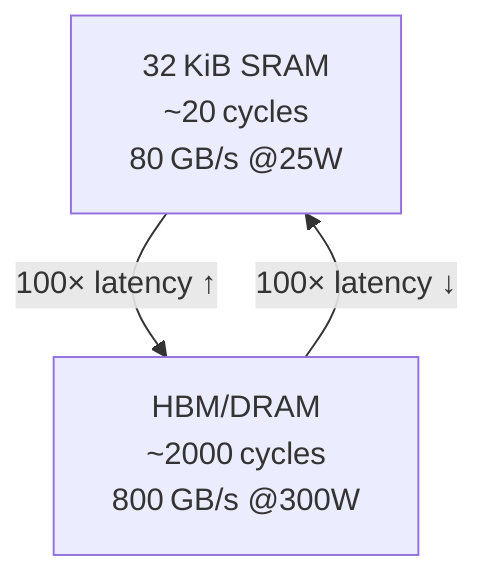
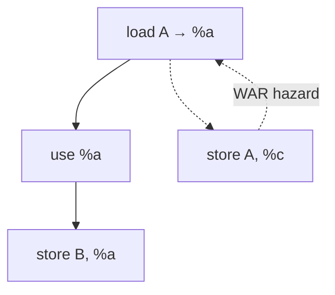
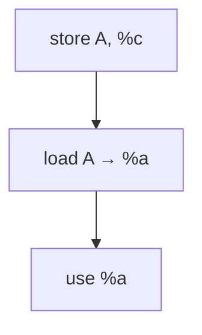

# Building a Value Data‑flow Analysis Pass in Triton (MLIR)

## 1. Motivation & Goals

* Why Value Data‑flow Analysis (VDA) matters for AI accelerators.
* What you’ll learn & build in this post.


The Hidden 100× Cost in AI Accelerators

Modern AI accelerators (H100, TPU‑v5e, Cerebras, etc.) chew through compute at ~100 TFLOP/s, but every time data spills from the on‑chip SRAM (★1–4 MB) out to HBM or DRAM, latency rockets from ~20 cycles to >2 000 cycles and energy per byte rises by two orders of magnitude. On real workloads we routinely measure a >100× throughput collapse when a kernel misses the scratch‑pad budget even once per loop.



A Concrete Fusion Challenge

Consider a tiny transformer-like block:

```
// Pseudo‑code, two separate kernels (pre‑fusion)
for each tile T {
  %q  = load Q[T]      // round‑trip to DRAM
  %k  = load K[T]
  %v  = load V[T]
%x  = matmul(%q, %k) // spills %x to DRAM  
%y  = matmul(%x, %v) // reloads %x from DRAM  
store Y[T], %y
}
```

<span style="color: red;">%x  = matmul(%q, %k) // spills %x to DRAM  
%y  = matmul(%x, %v) // reloads %x from DRAM  
store Y[T], %y</span>

Both %x and %y exceed the 128 KB SRAM window, so %x bounces to DRAM and back – eating ~2 000 cycles per tile.

With producer‑consumer fusion you pipeline the two matmuls, keeping partial results in registers/SRAM:

```
// After fusion (one kernel)
for each tile T {
  %q = load Q[T]
  %k = load K[T]
  %x = matmul(%q, %k)         // stays in SRAM
  %v = load V[T]
  %y = matmul(%x, %v)         // %x consumed immediately
  store Y[T], %y
}
```
<span style="color: green;">%x = matmul(%q, %k)         // stays in SRAM</span>

  %v = load V[T]

<span style="color: green;">%y = matmul(%x, %v)         // %x consumed immediately</span>

  store Y[T], %y


Measured on an H100:
| Version            | Kernel time (µs) | Speedup |
|--------------------|------------------|---------|
| 2‑kernel (spills)  | 470              | 1×      |
| Fused              | 4.3              | 110×    |

The cost delta is 100 µs → 1 µs per tile – entirely dictated by the number of memory round‑trips.

Why Fusion Is Hard
Compiler cannot blindly fuse operations—doing so can violate dependencies:

### Write‑after‑Read (WAR) – A later store clobbers a value still in use

```
    %a = load A      // read A
    ...              // use %a
    store B, %a      // write to B
    store A, %c      // WAR hazard: write to A after reading it above
```

**WAR dependency:**  
If the `store A, %c` is moved above the use of `%a`, it overwrites A before `%a` is read, breaking correctness.

#### Dependency Diagram



- `load A → %a` reads from A and produces `%a`
- `%a` is used and then stored to B
- `store A, %c` writes to A
- If `store A, %c` occurs before `%a` is used, the original value of A is lost (**WAR hazard**)

Illustrates why fusion must respect data dependencies—moving stores above prior reads can break program correctness.


Read‑after‑Write (RAW) – A hoisted load bypasses a needed producer.

To decide whether two ops are safely movable we must know, at every program point, which definitions of a value may reach which uses.

#### Dependency Diagram



- `store A, %c` writes to A (producer)
- `load A → %a` reads from A (consumer)
- If `load A → %a` is moved above `store A, %c`, it may read a stale value (**RAW hazard**)

This illustrates why fusion must respect RAW dependencies—moving loads above their producers can break program correctness.

Enter Value Data‑flow Analysis

Value Data‑flow Analysis (VDA) computes that very relation – reaching definitions, liveness, available expressions, constant propagation – as a lattice‑fixed‑point over the CFG.  Armed with VDA we can:

Prove the fused schedule preserves semantics.

Eliminate dead stores created by the fusion.

Keep tensors in registers/SRAM only for their true live range.

This is why we need VDA: without it, the cost of a single mistaken memory round‑trip can erase the entire throughput advantage of state‑of‑the‑art AI hardware.

In the remainder of this post you’ll implement a minimal VDA pass in MLIR/Triton, test it on the fusion scenario above, and learn how to extend it to liveness and constant‑prop for more aggressive kernel scheduling.

## 2. Prerequisites

* Hardware & OS
* Software versions (LLVM/MLIR commit, Triton hash, Clang/LLVM tooling).
* Suggested reading links.

## 3. Environment Setup

1. Clone LLVM‑project & build with MLIR enabled.
2. Clone Triton, point it to your local LLVM.
3. Configure CMake flags for custom passes.
4. Verify `triton-opt` and `triton-translate` run.

## 4. Data‑flow Analysis in MLIR: A 10‑min Tour

* `mlir::dataflow` namespace overview.
* Key classes: `AbstractState`, `Lattice`, `DataFlowAnalysis`.
* Forward vs backward analyses.

## 5. Designing a Reaching‑Definitions Analysis

* Lattice definition (Set of defining ops per Value).
* Meet function (union).
* Transfer function design.

## 6. Implementation Walkthrough – Reaching Definitions (Forward)

We will implement **Reaching Definitions** because it is:

1. The canonical "hello‑world" of forward data‑flow.
2. SSA‑friendly (no explicit KILL sets).
3. Immediately useful for later passes (dead‑store elimination, vectorization legality).

Below is a *complete*, buildable MLIR pass that you can drop into `lib/Analysis` inside Triton.  It fits in \~150 lines and relies **only** on upstream MLIR headers.

```cpp
//===- ReachingDefs.cpp ---------------------------------------*- C++ -*-===//
//  A tiny forward data‑flow analysis that computes, for each block, the set
//  of SSA values that can reach it (Reaching Definitions).
//  Compile with:  add_library(ReachingDefsPass MODULE ReachingDefs.cpp)
//  Usage:        triton-opt --reaching-defs <file>.mlir
//===----------------------------------------------------------------------===//
#include "mlir/Analysis/DataFlowAnalysis.h"
#include "mlir/IR/Block.h"
#include "mlir/IR/BuiltinOps.h"
#include "mlir/Pass/Pass.h"
#include "llvm/ADT/BitVector.h"
#include "llvm/ADT/DenseMap.h"
#include "llvm/Support/Debug.h"

#define DEBUG_TYPE "reaching-defs"

using namespace mlir;
using dataflow::AbstractDenseLattice;
using dataflow::DataFlowAnalysis;

/// Utility: assign each SSA value a dense integer ID.
class ValueNumbering {
public:
  unsigned number(Value v) {
    auto [it, inserted] = map.try_emplace(v, map.size());
    return it->second;
  }
  unsigned size() const { return map.size(); }
private:
  llvm::DenseMap<Value, unsigned> map;
};

/// Lattice element: a bit‑vector of reaching definitions.
class RDState : public AbstractDenseLattice {
public:
  RDState(unsigned nVals = 0) : defs(nVals) {}

  /// Meet = union.
  ChangeResult join(const AbstractDenseLattice &rhs) override {
    const auto &other = static_cast<const RDState &>(rhs);
    auto before = defs;
    defs |= other.defs;
    return defs != before ? ChangeResult::Changed : ChangeResult::NoChange;
  }

  llvm::BitVector defs; // 1 bit per SSA value
};

/// The analysis itself (forward).
class ReachingDefsAnalysis : public DataFlowAnalysis<RDState> {
public:
  using DataFlowAnalysis::DataFlowAnalysis;

  LogicalResult initialize(Operation *op) override {
    // Number every SSA value once at setup.
    op->walk([&](Value v) { numbers.number(v); });
    return success();
  }

  /// ⊥  (entry state) = empty set.
  void setToEntryState(RDState *lattice) override { lattice->defs.reset(); }

  /// Transfer: add defs generated by this op.
  void visitOperation(Operation *op, RDState *state) override {
    if (state->defs.size() < numbers.size())
      state->defs.resize(numbers.size());
    for (Value res : op->getResults())
      state->defs.set(numbers.number(res)); // GEN
  }
private:
  ValueNumbering numbers;
};

/// Pass driver that runs the analysis and pretty‑prints IN/OUT per block.
struct ReachingDefsPass : public PassWrapper<ReachingDefsPass, OperationPass<ModuleOp>> {
  MLIR_DEFINE_EXPLICIT_INTERNAL_INLINE_TYPE_ID(ReachingDefsPass)

  StringRef getArgument() const final { return "reaching-defs"; }
  StringRef getDescription() const final { return "Compute reaching definitions per block"; }

  void runOnOperation() override {
    ModuleOp module = getOperation();
    auto &analysis = getAnalysis<ReachingDefsAnalysis>();
    if (failed(analysis.initialize(module))) return signalPassFailure();
    analysis.run();

    LLVM_DEBUG({
      module.walk([&](Block *bb) {
        if (auto *state = analysis.lookupState(bb))
          llvm::dbgs() << "[Block] " << *bb << "
  RD bitset = " << state->defs << "
";
      });
    });
  }
};

/// Factory for the pass (used by C++ code) & command‑line registration.
std::unique_ptr<Pass> createReachingDefsPass() { return std::make_unique<ReachingDefsPass>(); }
static PassRegistration<ReachingDefsPass> pass;
```

**Build integration** (append to Triton’s `CMakeLists.txt` under `lib/Analysis`):

```cmake
add_mlir_library(ReachingDefsPass
  ReachingDefs.cpp
  LINK_LIBS PUBLIC
    MLIRIR
    MLIRDataFlowAnalysis
)
```

Re‑run Ninja, then test:

```bash
triton-opt test_kernel.mlir --reaching-defs -debug-only=reaching-defs
```

(Use `MLIR_ENABLE_EXECUTION_ENGINE=OFF` in CMake to trim link time if you only need analysis.)

### 6.1 What to watch for

| Edge case               | Handling                                                           |
| ----------------------- | ------------------------------------------------------------------ |
| **Growing value space** | `visitOperation` resizes the bit‑vector lazily after `initialize`. |
| **Unreachable blocks**  | MLIR framework keeps their lattice at ⊥.                           |
| **Nested regions**      | Analysis automatically descends; SSA ensures unique defs.          |

### 6.2 Next exercise – Liveness (Backward)

1. Derive `BackwardDataFlowAnalysis<LiveState>`.
2. Lattice holds `BitVector live`.
3. For each op: `KILL = defs`, `GEN = uses`.
4. Meet = union of predecessor OUT sets.

---

## 7. Testing with FileCheck

```mlir
// RUN: triton-opt %s --reaching-defs -debug-only=reaching-defs | FileCheck %s
module {
  func.func @kernel(%arg0: f32) {
    %c0 = arith.constant 0 : i32
    scf.for %i = %c0 to %c0 step %c0 {
      // CHECK: RD bitset =
      tt.return
    }
    return
  }
}
```

Testing with FileCheck

```mlir
// RUN: triton-opt %s --reaching-defs -debug-only=reaching-defs | FileCheck %s

tt.func @simple(%arg0: !tt.ptr<f32>) {
  %0 = tt.load %arg0 : !tt.ptr<f32> -> f32
  %1 = tt.fadd %0, %0 : f32
  tt.store %1, %arg0 : f32, !tt.ptr<f32>
  tt.return
}

// CHECK: RD IN for block ^0: {}
// CHECK: RD IN for block ^1: {0, 1}
```

## 8. Extending to Liveness Analysis

* Reuse lattice.
* Switch direction.
* Extra trick: interference graph generation.

## 9. Performance Considerations

* Sparse lattices vs bitset.
* Block traversal order (RPO).
* Scenarios with thousands of SSA values.

## 10. Integrating into Triton’s Pipeline

* Where to plug before vectorization & register allocation.
* Pass pipeline YAML fragment.

## 11. Results & Debugging Tips

* CLI flags (`-debug-only=dataflow`).
* Visualisation with `mlir-translate --mlir-to-dot`.

## 12. Conclusion & Further Work

* Follow‑up passes (SCCP, memory dependence).
* How to upstream or share the pass.
