*A technical discussion of how large language models can speed up GPU kernel optimization, from research ideas to production kernels.*

Some of the ideas in this article were tested in public: an earlier version placed as one of the four winning projects in the GPU Mode hackathon, with follow-on work explored during the xAI hackathon.

---

## Table of Contents

1. [Introduction: The Kernel Optimization Crisis](#introduction)
2. [The Computational Foundation](#computational-foundation)
3. [From Strassen to Tensors: The Mathematical Framework](#mathematical-framework)
4. [DeepMind's Journey: AlphaTensor → AlphaEvolve](#deepmind-journey)
5. [AlphaEvolve Architecture Deep Dive](#alphaevolve-architecture)
6. [The Helion Integration: From DSL to Optimized Kernels](#helion-integration)
7. [Prompt Engineering for Kernel Evolution](#prompt-engineering)
8. [Diff-Based Code Generation](#diff-generation)
9. [The GEMM Case Study: Production Results](#gemm-case-study)
10. [Implications and Future Directions](#future-directions)

---


```
Note: References to AlphaEvolve below refer to OpenEvolve, the open-source implementation of the AlphaEvolve paper: https://github.com/algorithmicsuperintelligence/openevolve

The underlying ideas and algorithms are described in Google DeepMind's AlphaEvolve paper. The implementation and supporting tooling, including the visualization dashboard and evaluation with a weighted council of LLMs, are provided by OpenEvolve. Thanks to the OpenEvolve authors for their work.
```

<a name="introduction"></a>
## 1. Introduction: The Kernel Optimization Crisis

Modern ML workloads spend much of their time in matrix multiplication. Transformer attention, convolutions, and gradient updates reduce to matrix operations executed on specialized hardware. Their efficiency determines training cost and inference latency.

In practice, the gap between published algorithms and production kernels is often months to years.

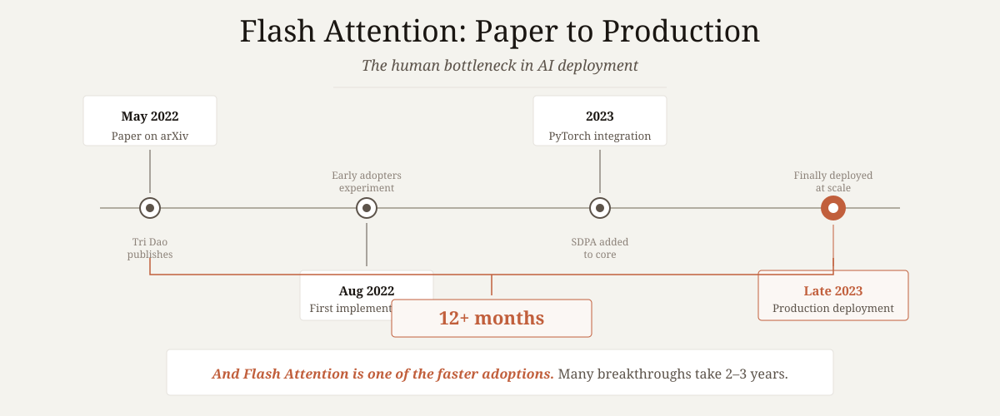

Consider Flash Attention, published in May 2022. It reduced attention's memory complexity from O(n²) to O(n). It took over 12 months before it was widely usable in production frameworks. Turning a paper into an optimized and deployable implementation typically requires:

1. **Deep understanding** of the algorithm's mathematical properties
2. **Hardware expertise** spanning memory hierarchies, instruction sets, and parallelism models
3. **Systems engineering** for integration with existing frameworks
4. **Exhaustive tuning** across different input shapes and hardware configurations

Many changes do not survive this process.

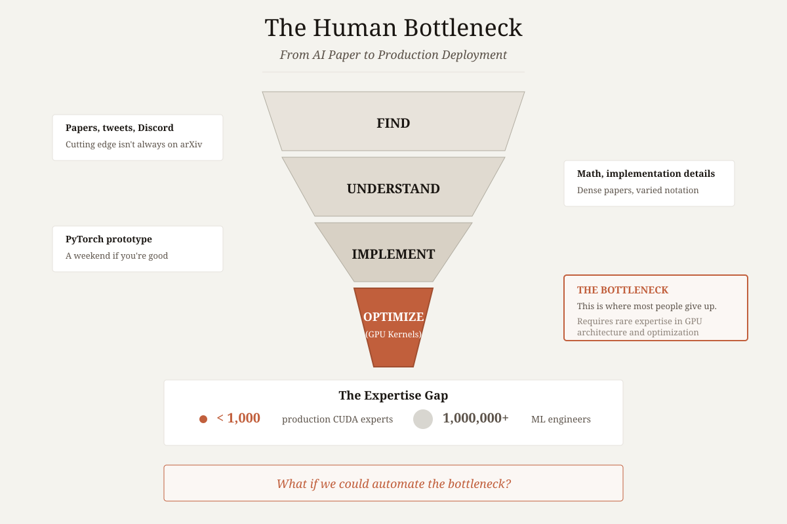

Hundreds of optimization papers appear each year. Some are implemented. Fewer are optimized and maintained in production. For kernels, the work is specialized and slow.

### The Search Space Problem

Kernel optimization has a large configuration space. For a single GPU matrix multiplication kernel, the space includes:

- **Tile sizes**: How to partition the computation (e.g., 64×64, 128×128, 256×64)
- **Block dimensions**: Thread block organization (e.g., 128, 256, 512 threads)
- **Memory staging**: Shared memory allocation and access patterns
- **Loop ordering**: Which dimensions to iterate first
- **Vectorization**: SIMD width and memory coalescing
- **Pipelining stages**: Overlapping computation with memory transfers

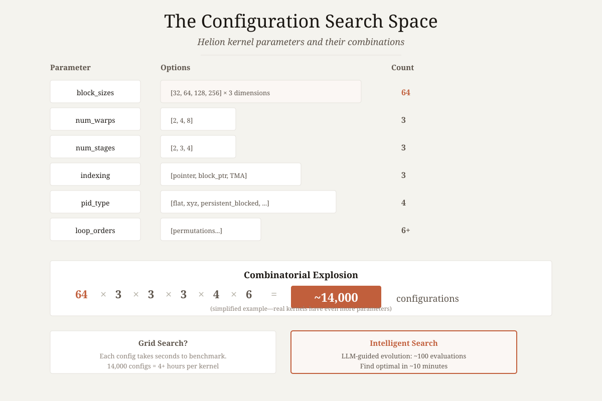

Each parameter has multiple valid values. The product is often millions or billions of configurations. Most are slow; a few are good for specific shapes. Exhaustive search is infeasible. Random search wastes evaluations. Manual tuning does not scale.

### The Vision: Self-Improving AI Infrastructure

If a system can improve its own kernels, training time drops. Faster training makes more evaluation budget available for further optimization.

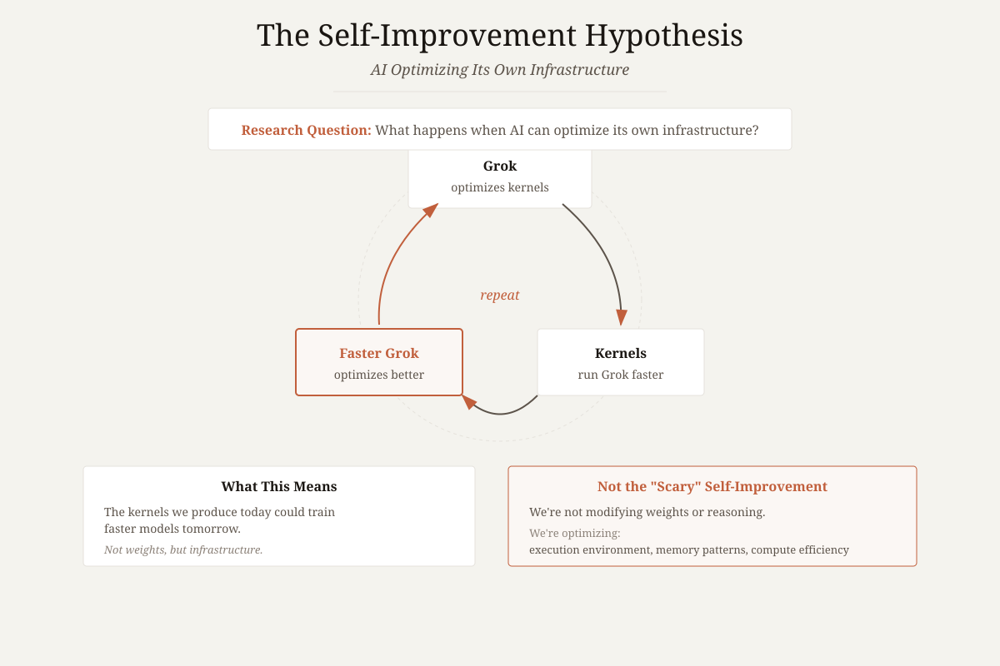

In 2025, DeepMind's AlphaEvolve reported Gemini optimizing parts of its training pipeline, including kernel heuristics, and reducing overall training time by 1%.

This document describes the technical basis for this approach and the mechanisms used in these systems.

---

<a name="computational-foundation"></a>
## 2. The Computational Foundation

This section describes the computation being optimized. The primary primitive is matrix multiplication.

### Matrix Multiplication: The Basics

Multiplying an M×K matrix A by a K×N matrix B produces an M×N matrix C:

```
C[i,j] = Σₖ A[i,k] × B[k,j]
```

Each output element requires K multiplications and K-1 additions. The full operation uses M×N×K multiplications. For n×n matrices, the complexity is O(n³), so matrix multiplication dominates training and inference cost.

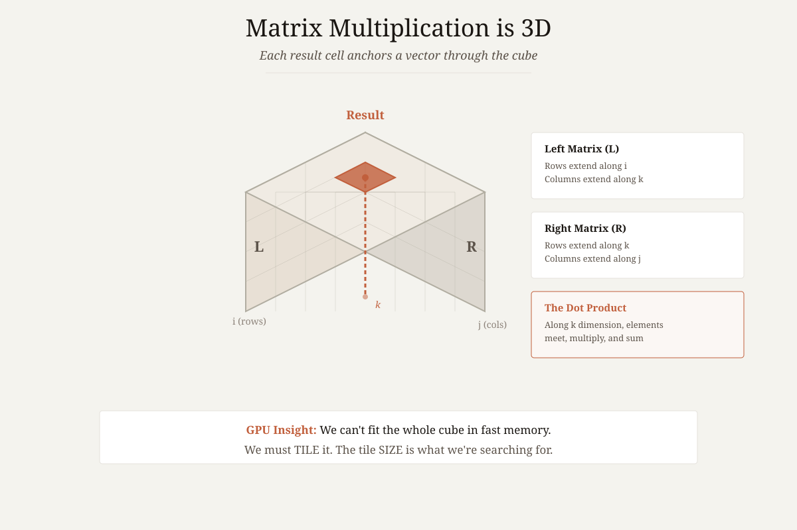

The computation can be viewed as a 3D grid: each output element is a dot product, represented as a line through the input matrices.

### Why Tiling Matters

Modern GPUs have a memory hierarchy:
- **Registers**: Fastest, tiny (kilobytes per SM)
- **Shared Memory/L1 Cache**: Fast, small (tens of KB per SM)
- **L2 Cache**: Medium speed, medium size (megabytes)
- **Global Memory (HBM)**: Slow, large (tens of GB)

The bandwidth gap between levels is 10-100×. A kernel that repeatedly fetches from global memory is memory-bound. Tiling reduces global memory traffic by increasing reuse in fast memory.

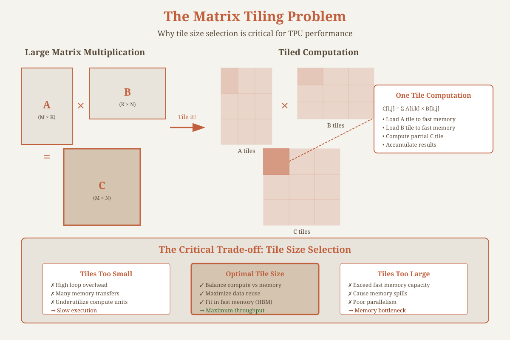

Tiling divides the large matrix multiplication into smaller sub-problems that fit in fast memory:

1. Load a tile of A into shared memory
2. Load a tile of B into shared memory
3. Compute the partial result for the C tile
4. Accumulate and repeat

The choice is the tile size.

- **Too small**: Overhead from many tiles, underutilized compute units, insufficient data reuse
- **Too large**: Tiles don't fit in shared memory, cause register spills, reduce occupancy
- **Just right**: Maximizes data reuse while fitting in fast memory and maintaining high occupancy

The optimal tile size depends on:
- Matrix dimensions (M, N, K)
- Data type (fp32, fp16, bf16, int8)
- Hardware capabilities (shared memory size, register count, tensor core availability)
- Memory access patterns (contiguous vs. strided)

This motivates autotuning and explains its cost.

### The Cost of Operations

The relative cost of operations constrains algorithm design:

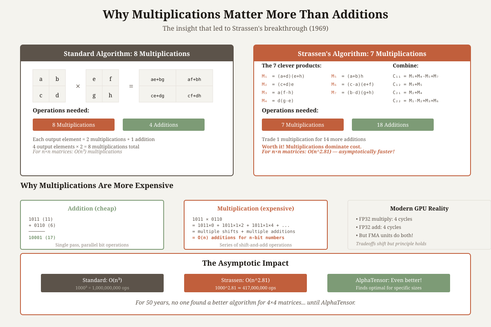

On modern CPUs, a 64-bit integer multiplication takes approximately **20 cycles**. An addition? Just **1 cycle**. That's a 20× difference.

If the same result can be computed with fewer multiplications, additional additions may be acceptable.

Consider computing a² - b²:

**Method 1**: a×a - b×b
- 2 multiplications + 1 addition = 2×20 + 1 = **41 cycles**

**Method 2**: (a+b) × (a-b)
- 1 multiplication + 2 additions = 1×20 + 2 = **22 cycles**

Same result, **46% faster**. This is a standard trade: reduce expensive operations at the cost of cheaper ones.

---

<a name="mathematical-framework"></a>
## 3. From Strassen to Tensors: The Mathematical Framework

### The Strassen Breakthrough

In 1969, Volker Strassen showed that 2×2 matrices can be multiplied with fewer than 8 multiplications.

Standard 2×2 matrix multiplication:
```
[c₁ c₂]   [a₁ a₂]   [b₁ b₂]
[c₃ c₄] = [a₃ a₄] × [b₃ b₄]

c₁ = a₁b₁ + a₂b₃
c₂ = a₁b₂ + a₂b₄
c₃ = a₃b₁ + a₄b₃
c₄ = a₃b₂ + a₄b₄
```

That's 8 multiplications and 4 additions. Total: 8×20 + 4×1 = **164 cycles**.

Strassen found a way to do it with 7 multiplications:

```
m₁ = (a₁ + a₄)(b₁ + b₄)
m₂ = (a₃ + a₄)b₁
m₃ = a₁(b₂ - b₄)
m₄ = a₄(b₃ - b₁)
m₅ = (a₁ + a₂)b₄
m₆ = (a₃ - a₁)(b₁ + b₂)
m₇ = (a₂ - a₄)(b₃ + b₄)

c₁ = m₁ + m₄ - m₅ + m₇
c₂ = m₃ + m₅
c₃ = m₂ + m₄
c₄ = m₁ - m₂ + m₃ + m₆
```

That's 7 multiplications and 18 additions. Total: 7×20 + 18×1 = **158 cycles**.

The savings for 2×2 is small, but Strassen's algorithm is recursive. Applied to blocks, the complexity drops from O(n³) to O(n^log₂7) ≈ O(n^2.807).

Lower exponents require different multiplication algorithms.

### The Tensor Decomposition Framework

Matrix multiplication algorithms can be described as tensor decompositions.

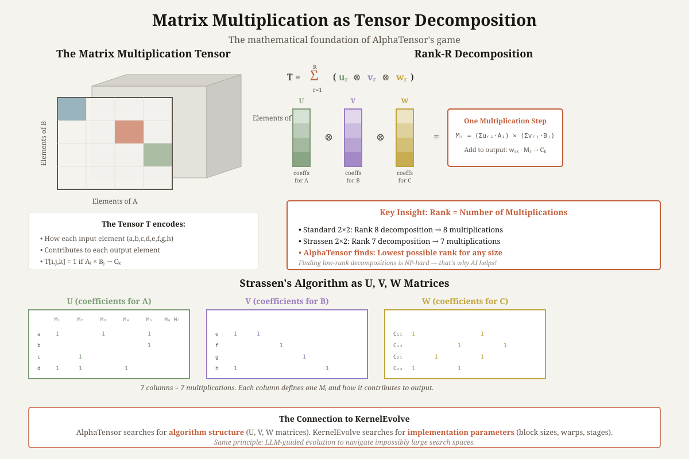

Any algorithm for multiplying n×n matrices can be encoded as a decomposition of a specific 3D tensor T:

```
T = Σᵣ uᵣ ⊗ vᵣ ⊗ wᵣ
```

Where:
- **uᵣ**: Vector specifying which entries of A to combine for multiplication r
- **vᵣ**: Vector specifying which entries of B to combine for multiplication r
- **wᵣ**: Vector specifying where the result contributes in C
- **R**: The rank of the decomposition = **the number of multiplications**

The tensor T encodes the structure of matrix multiplication: T[a,b,c] = 1 if entry a of A times entry b of B contributes to entry c of C.

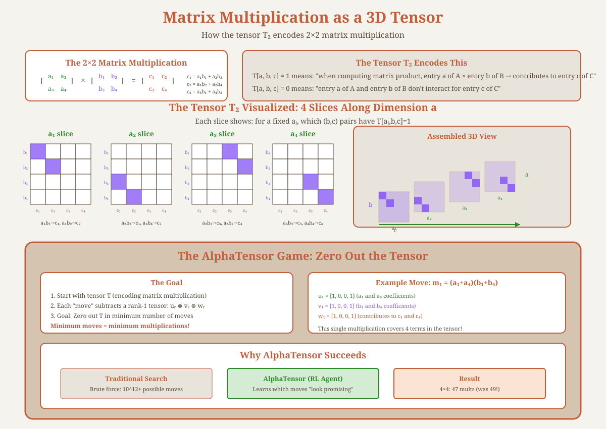

For 2×2 matrices, T is a 4×4×4 tensor. The standard algorithm corresponds to a rank-8 decomposition (8 multiplications). Strassen's algorithm is a rank-7 decomposition.

**Finding faster matrix multiplication algorithms is equivalent to finding lower-rank tensor decompositions.**

This is a mathematical optimization problem and can be searched computationally.

### The AlphaTensor Game

AlphaTensor casts tensor decomposition as a single-player game.

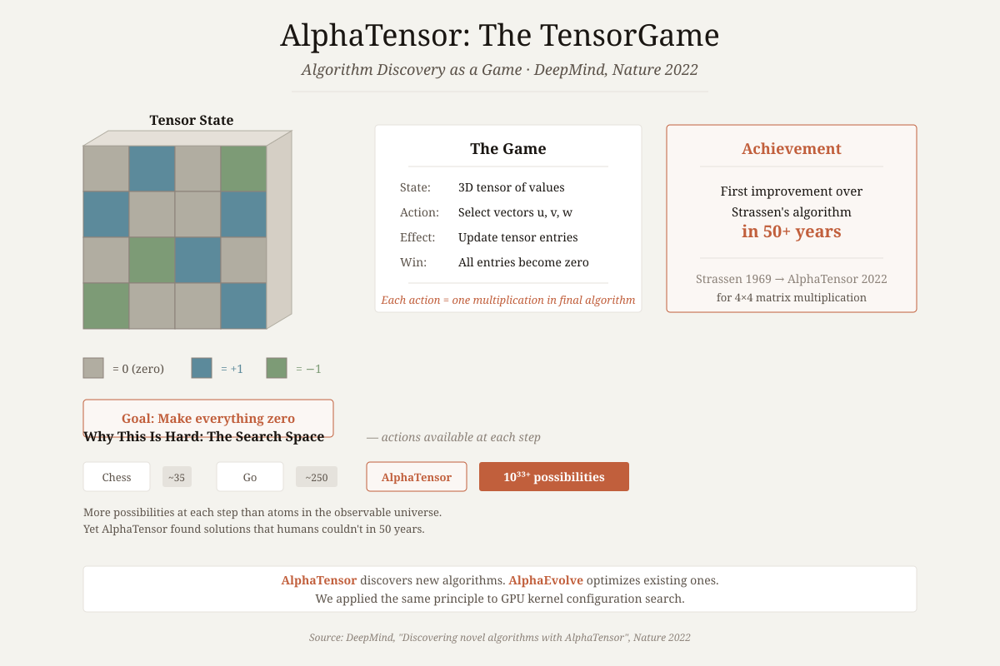

**Game Setup:**
- **Board state**: The target tensor T (initially non-zero)
- **Goal**: Zero out all entries of T
- **Moves**: Subtract rank-1 tensors (outer products u ⊗ v ⊗ w)
- **Score**: Minimize the number of moves

When the tensor reaches all zeros, the sequence of moves defines a valid matrix multiplication algorithm. The number of moves equals the number of multiplications.

This game has several difficult properties:
- **Massive action space**: For 4×4 matrices, each move has >10³³ possible choices
- **Long horizons**: Optimal solutions require dozens of moves
- **Sparse rewards**: Only terminal states (all zeros) give meaningful feedback

Deep reinforcement learning can be applied to this type of sparse-reward, long-horizon search.

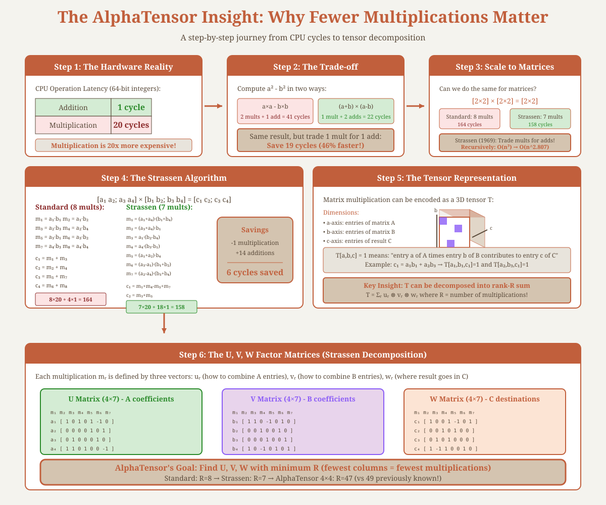

---

<a name="deepmind-journey"></a>
## 4. DeepMind's Journey: AlphaTensor → AlphaEvolve

### AlphaTensor (2022): Game-Playing AI for Math

AlphaTensor combined AlphaZero-style reinforcement learning with the TensorGame formulation.

**Architecture:**
- Deep neural network trained from scratch
- Monte Carlo Tree Search (MCTS) for action selection
- Self-play training to improve over time

**Results:**
- Discovered algorithms for 4×4 binary matrices using 47 multiplications (vs. 49 for Strassen's two-level recursion)
- First improvement on Strassen's algorithm in 50 years
- Found 14,236 nonequivalent algorithms for various matrix sizes

**Limitations:**
- Specialized for matrix multiplication only
- Required retraining for each problem size
- Only worked with binary (0/1) matrices
- Output was mathematical factors, not executable code
- Massive computational requirements for training

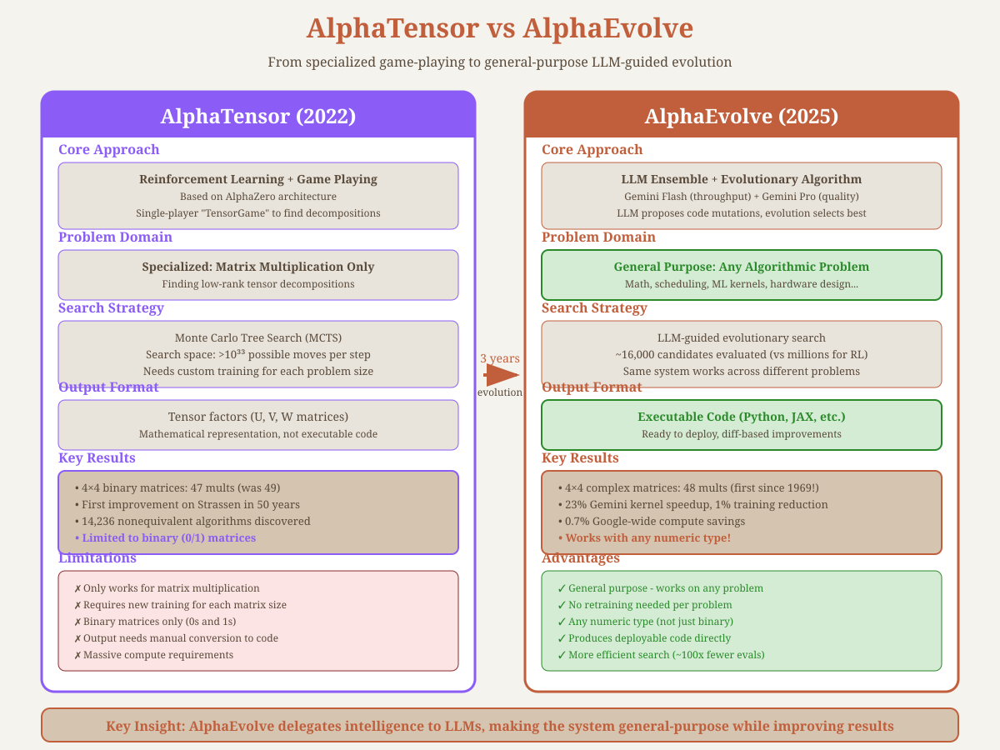

### AlphaDev (2023): Assembly-Level Optimization

AlphaDev applied similar techniques to sorting algorithms:
- Operated at the assembly instruction level
- Found faster sorting routines for small arrays
- Deployed improvements to LLVM's libc++

This showed RL-based search producing code intended for production use, not only mathematical factors. The approach remained specialized.

### FunSearch (2024): LLMs Enter the Picture

FunSearch replaces a trained value/policy network with a pre-trained LLM.

**Key Innovation:**
- Use a pre-trained model rather than training from scratch
- LLM generates Python functions; evaluator scores them
- Evolutionary selection keeps the best programs

**Results:**
- Found new constructions for the "cap set problem" in combinatorics
- Discovered improved bin-packing heuristics
- Demonstrated LLM-guided search could find novel mathematical results

**Limitation:**
- Still focused on mathematical functions
- Limited code generation scope

### AlphaEvolve (2025): The General-Purpose System

DeepMind's AlphaEvolve paper describes a general-purpose system for algorithm discovery across domains.

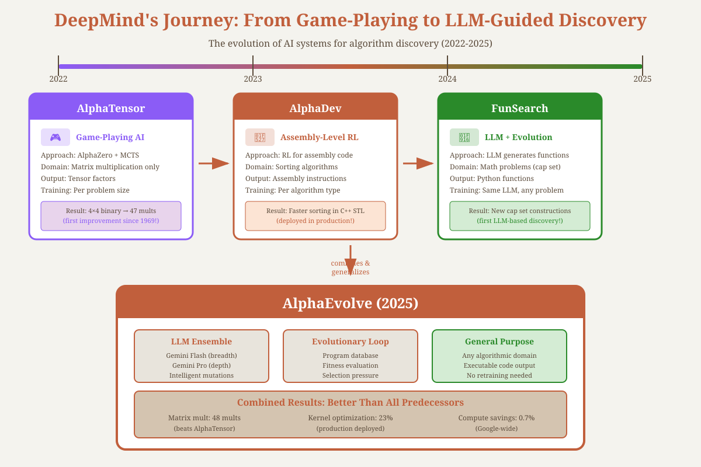

**Key Advances:**
1. **LLM Ensemble**: Gemini Flash for throughput, Gemini Pro for quality
2. **Diff-Based Generation**: Targeted modifications, not full code generation
3. **General Purpose**: Same system works on math, scheduling, kernels, hardware design
4. **Production Output**: Generates executable code ready for deployment

This replaces training domain-specific models with using pre-trained LLMs guided by prompts.

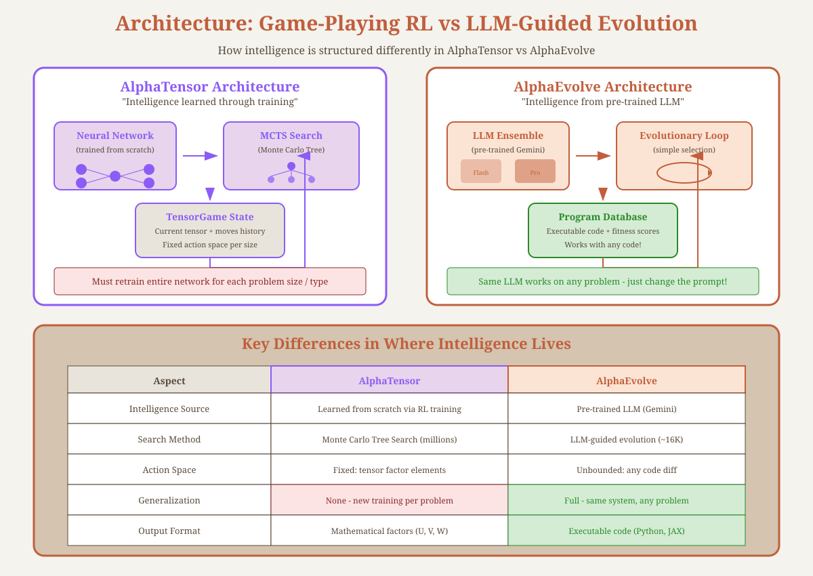

---

<a name="alphaevolve-architecture"></a>
## 5. AlphaEvolve Architecture Deep Dive

### System Components

In the AlphaEvolve paper, the system is organized into four components. OpenEvolve implements a similar structure:

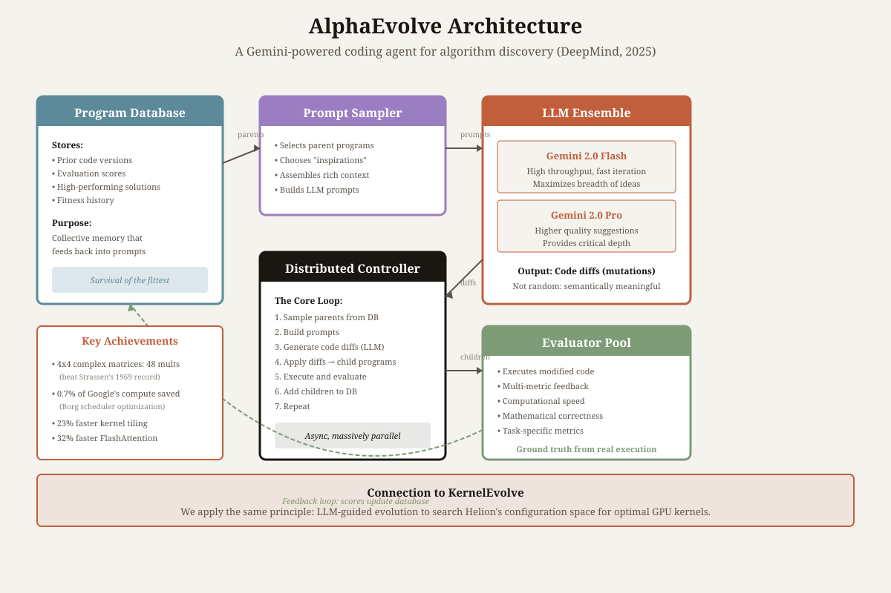

#### 1. Program Database

The program database stores the evolving population of candidate programs:

```python
@dataclass
class ProgramEntry:
    code: str                    # The actual program code
    fitness: float               # Performance score (lower is better for runtime)
    parent_id: Optional[str]     # Lineage tracking
    generation: int              # When it was created
    metadata: Dict               # Input shapes, hardware config, etc.
```

The database supports:
- **Diverse sampling**: Select programs spanning the fitness landscape
- **Lineage tracking**: Understand which mutations led to improvements
- **Island populations**: Maintain diversity through isolated subpopulations
- **Fitness caching**: Avoid re-evaluating unchanged programs

#### 2. Prompt Sampler

The prompt sampler selects programs and constructs prompts for the LLM:

```python
def sample_for_mutation(database: ProgramDatabase) -> List[Prompt]:
    prompts = []

    # Sample from different fitness levels
    top_programs = database.top_k(k=10)
    diverse_programs = database.sample_diverse(k=5)

    for program in top_programs + diverse_programs:
        prompt = construct_mutation_prompt(
            program=program,
            fitness_history=database.get_lineage(program),
            improvement_hints=analyze_bottlenecks(program)
        )
        prompts.append(prompt)

    return prompts
```

The sampling strategy balances:
- **Exploitation**: Improving the current best programs
- **Exploration**: Mutating diverse programs to escape local optima
- **Recombination**: Combining ideas from different high-performing programs

#### 3. LLM Ensemble

The ensemble combines multiple models with different strengths:

**Gemini Flash (Throughput)**
- Fast inference, lower cost
- Generates many candidate mutations
- Good for broad exploration

**Gemini Pro (Quality)**
- Slower but more sophisticated
- Generates higher-quality, more targeted mutations
- Good for refining promising directions

```python
def generate_mutations(prompts: List[Prompt]) -> List[CodeDiff]:
    diffs = []

    # Parallel generation from both models
    flash_outputs = gemini_flash.generate_batch(prompts, n_samples=10)
    pro_outputs = gemini_pro.generate_batch(prompts, n_samples=3)

    for output in flash_outputs + pro_outputs:
        diff = parse_diff(output)
        if diff.is_valid():
            diffs.append(diff)

    return diffs
```

#### 4. Evaluator Pool

The evaluator pool runs candidate programs on hardware:

```python
class EvaluatorPool:
    def __init__(self, hardware_configs: List[HardwareConfig]):
        self.workers = [
            EvaluatorWorker(config) for config in hardware_configs
        ]

    def evaluate_batch(self, programs: List[Program]) -> List[FitnessResult]:
        # Distribute across available hardware
        futures = []
        for program, worker in zip(programs, cycle(self.workers)):
            future = worker.evaluate_async(program)
            futures.append(future)

        # Collect results with timeout
        results = []
        for future in futures:
            try:
                result = future.get(timeout=EVAL_TIMEOUT)
                results.append(result)
            except TimeoutError:
                results.append(FitnessResult(fitness=float('inf'), error="timeout"))

        return results
```

Key evaluation considerations:
- **Real hardware**: No simulators:actual TPU/GPU execution
- **Multiple input shapes**: Evaluate on training set of realistic shapes
- **Correctness checking**: Verify output matches reference implementation
- **Statistical robustness**: Multiple runs to handle variance

### The Evolutionary Loop

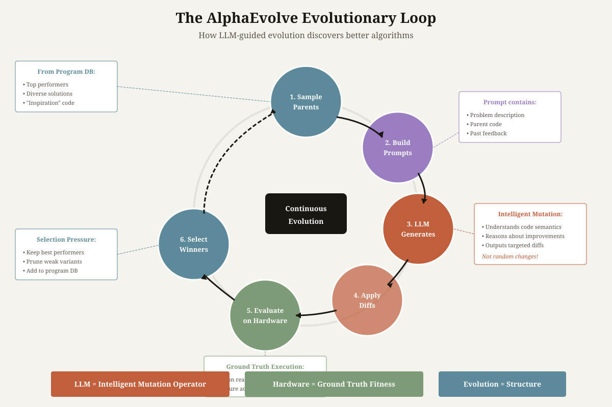

The complete loop:

```python
def evolve(initial_program: str, fitness_fn: Callable, generations: int):
    database = ProgramDatabase()
    database.add(initial_program, fitness_fn(initial_program))

    for gen in range(generations):
        # 1. Sample programs to mutate
        prompts = sample_for_mutation(database)

        # 2. Generate mutations with LLM ensemble
        diffs = generate_mutations(prompts)

        # 3. Apply diffs to create candidates
        candidates = []
        for prompt, diff in zip(prompts, diffs):
            new_program = apply_diff(prompt.program, diff)
            if validate_syntax(new_program):
                candidates.append(new_program)

        # 4. Evaluate on real hardware
        results = evaluator_pool.evaluate_batch(candidates)

        # 5. Select survivors
        for program, result in zip(candidates, results):
            if result.is_correct and result.fitness < database.worst_fitness():
                database.add(program, result.fitness)

        # 6. Prune database to maintain size
        database.prune(max_size=POPULATION_SIZE)

        log_generation_stats(gen, database)

    return database.best_program()
```

### Why LLM-Guided Mutations Work

Compared with traditional evolutionary algorithms, using an LLM changes the distribution of mutations.

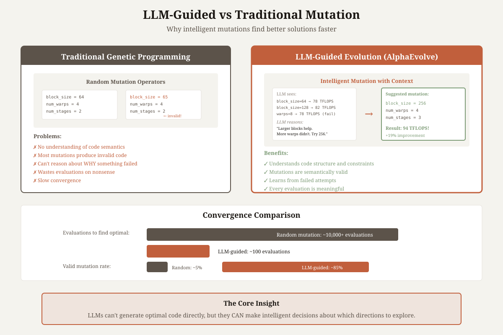

**Traditional Evolutionary Algorithms:**
- Random mutations: flip bits, change numbers, swap operators
- Most mutations break the code
- Those that don't usually make performance worse
- Requires thousands to millions of evaluations
- No semantic understanding

**LLM-Guided Evolution:**
- Semantic mutations: "increase tile size for better memory coalescing"
- LLM understands code structure and purpose
- Mutations preserve correctness while targeting performance
- Converges in hundreds of evaluations
- Leverages vast pre-training on code and documentation

The LLM contributes domain knowledge to the search:
- Understanding of memory hierarchies
- Knowledge of parallelization patterns
- Familiarity with optimization techniques
- Ability to reason about hardware constraints

---

<a name="helion-integration"></a>
## 6. The Helion Integration: From DSL to Optimized Kernels

### What is Helion?

Helion is PyTorch's domain-specific language for writing GPU kernels. It provides a Python interface that compiles to GPU code through Triton.

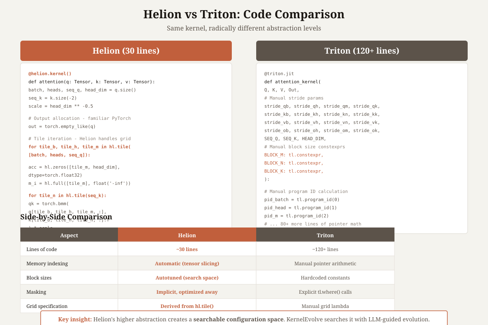

**Helion (30 lines):**
```python
import helion
import torch

@helion.kernel
def matmul(a: torch.Tensor, b: torch.Tensor) -> torch.Tensor:
    m, k = a.shape
    k, n = b.shape
    c = torch.zeros(m, n, dtype=a.dtype, device=a.device)

    for tile_m, tile_n in helion.tile([m, n], [BLOCK_M, BLOCK_N]):
        acc = helion.zeros([BLOCK_M, BLOCK_N], dtype=torch.float32)
        for tile_k in helion.tile(k, BLOCK_K):
            a_tile = a[tile_m, tile_k]
            b_tile = b[tile_k, tile_n]
            acc += a_tile @ b_tile
        c[tile_m, tile_n] = acc.to(c.dtype)

    return c
```

**Equivalent Triton (120+ lines):** Manual pointer arithmetic, explicit memory management, thread indexing...

The Helion version is shorter and keeps indexing and memory management implicit.

### The Compilation Pipeline

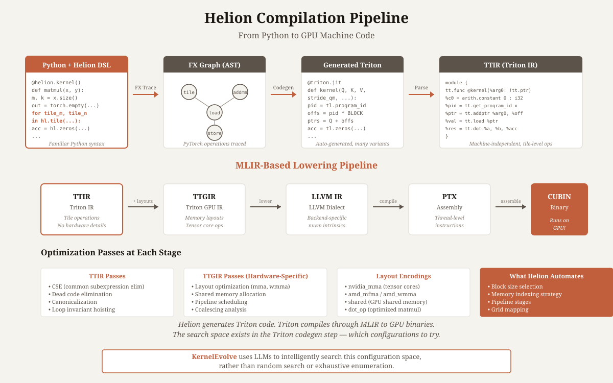

Helion code goes through multiple transformation stages:

1. **Python AST → Helion IR**: Parse the decorated function
2. **Helion IR → TTIR**: Triton's high-level intermediate representation
3. **TTIR → TTGIR**: GPU-specific transformations
4. **TTGIR → LLVM IR**: Lower to LLVM's representation
5. **LLVM IR → PTX**: NVIDIA's parallel thread execution assembly
6. **PTX → CUBIN**: Final binary for execution

Each stage exposes optimization opportunities:
- **Helion level**: Tile sizes, loop ordering, data types
- **TTIR level**: Memory layouts, vectorization
- **TTGIR level**: Thread block dimensions, shared memory allocation
- **LLVM level**: Instruction selection, register allocation

### The Autotuning Challenge

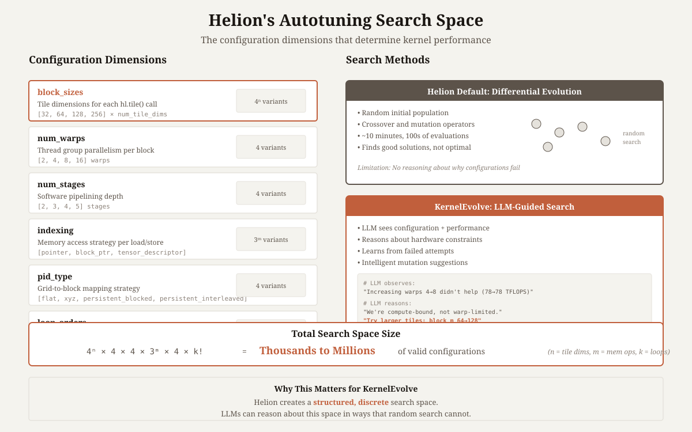

Helion exposes tunable parameters:

```python
@helion.kernel(
    configs=[
        helion.Config(BLOCK_M=64, BLOCK_N=64, BLOCK_K=32, num_warps=4),
        helion.Config(BLOCK_M=128, BLOCK_N=128, BLOCK_K=32, num_warps=8),
        helion.Config(BLOCK_M=256, BLOCK_N=64, BLOCK_K=64, num_warps=8),
        # ... many more
    ]
)
def matmul(a, b):
    ...
```

Traditional autotuning:
1. Enumerate all configurations
2. Benchmark each on representative inputs
3. Select the fastest

**Problems:**
- Exponential configuration space
- Hours of GPU time per kernel
- Must retune for each input shape
- Doesn't generalize

**The AlphaEvolve approach:**
The AlphaEvolve paper proposes evolving a heuristic function that selects configurations based on input properties, rather than tuning configurations directly.

---

<a name="prompt-engineering"></a>
## 7. Prompt Engineering for Kernel Evolution

LLM-guided evolution depends on prompt design.

### Prompt Structure

A mutation prompt contains:

```
<system>
You are an expert GPU kernel optimization engineer. Your task is to improve
the performance of Triton/Helion kernels while maintaining correctness.

You have deep knowledge of:
- GPU memory hierarchies (registers, shared memory, L2 cache, HBM)
- Thread block organization and occupancy
- Memory coalescing and bank conflicts
- Tensor core utilization
- Loop tiling and pipelining strategies

When suggesting improvements, consider:
- The specific input shapes and data types
- Hardware capabilities (compute units, memory bandwidth)
- The current bottleneck (compute-bound vs memory-bound)
</system>

<current_code>
{program_code}
</current_code>

<fitness_history>
Previous versions and their performance:
- v1: 2.3ms (baseline)
- v2: 2.1ms (increased BLOCK_M from 64 to 128)
- v3: 1.9ms (added software pipelining)
- v4 (current): 1.85ms (optimized memory access pattern)
</fitness_history>

<input_shapes>
Training set shapes (M, N, K):
- (4096, 4096, 1024)
- (8192, 2048, 512)
- (2048, 8192, 2048)
- (16384, 1024, 256)
</input_shapes>

<performance_analysis>
Current bottleneck: Memory-bound on large M shapes
Occupancy: 75% (limited by shared memory)
Tensor core utilization: 82%
Memory bandwidth: 85% of peak
</performance_analysis>

<task>
Suggest a specific code modification that could improve performance.
Provide your reasoning and the exact diff to apply.

Focus on one targeted change rather than rewriting everything.
Consider what worked in previous versions.
</task>
```

### Key Prompt Components

#### 1. System Context
State the role and constraints:

```
You are an expert GPU kernel optimization engineer specializing in:
- Triton and Helion DSLs
- NVIDIA GPU architecture (particularly {GPU_MODEL})
- Matrix multiplication and convolution kernels
- Memory hierarchy optimization
```

#### 2. Code Context
Include the current code and relevant context:

```python
# Include imports and helper functions
import triton
import triton.language as tl

# The kernel being optimized
@triton.jit
def matmul_kernel(
    a_ptr, b_ptr, c_ptr,
    M, N, K,
    stride_am, stride_ak,
    stride_bk, stride_bn,
    stride_cm, stride_cn,
    BLOCK_M: tl.constexpr,
    BLOCK_N: tl.constexpr,
    BLOCK_K: tl.constexpr,
):
    # ... kernel implementation
```

#### 3. Fitness History
Provide successful and unsuccessful changes:

```
Improvement history:
- Baseline: 2.34ms
- +12% from increasing BLOCK_M (64→128)
- +8% from software pipelining
- -3% from trying BLOCK_K=128 (register pressure)
- +5% from memory access reordering
```

This helps by:
- Avoid repeating failed experiments
- Build on successful directions
- Understand the performance landscape

#### 4. Input Characteristics
Provide workload information:

```
Input shape distribution:
- M: typically 1024-16384, often powers of 2
- N: typically 1024-8192
- K: typically 256-4096
- Dtype: bfloat16

Hardware: NVIDIA H100
- Shared memory: 228KB per SM
- Registers: 65536 per SM
- Tensor cores: 4th gen
```

#### 5. Performance Analysis
Include profiling data when available:

```
Bottleneck analysis:
- Compute utilization: 78% (room for improvement)
- Memory bandwidth: 92% of peak (nearly saturated)
- Occupancy: 62.5% (8 blocks per SM)
- Limiting factor: shared memory (using 196KB)

Recommendations based on analysis:
- Consider reducing shared memory usage to increase occupancy
- Memory-bound on small K; consider different strategy
- Tensor core utilization drops for non-aligned shapes
```

### Prompt Variations

Prompts vary by mutation type:

**Exploration Prompt (broad search):**
```
Suggest 3-5 different optimization directions we haven't tried yet.
For each, explain the potential benefit and risk.
```

**Exploitation Prompt (refine promising direction):**
```
The recent change to {specific_modification} improved performance by 8%.
How can we further optimize in this direction?
```

**Crossover Prompt (combine ideas):**
```
Program A uses approach X for memory access.
Program B uses approach Y for thread scheduling.
Can we combine the best aspects of both?
```

**Repair Prompt (fix broken mutation):**
```
The following mutation was attempted but failed validation:
{diff}
Error: {error_message}
How can we achieve the same optimization goal while fixing the error?
```

---

<a name="diff-generation"></a>
## 8. Diff-Based Code Generation

AlphaEvolve uses diff-based generation: the LLM proposes targeted code changes rather than rewriting entire programs. OpenEvolve uses the same working style.

### Why Diffs?

**Full generation problems:**
- LLMs make mistakes:regenerating everything amplifies errors
- Loses tested, working code
- Expensive in tokens and compute
- Hard to trace what changed

**Diff advantages:**
- Preserves working code
- Focuses attention on the change
- Easier to validate
- Clear attribution of improvements/regressions

### Diff Format

AlphaEvolve uses a structured diff format:

```
<reasoning>
The current implementation loads tiles of A and B sequentially. On memory-bound
shapes, we're not fully utilizing memory bandwidth because compute waits for loads.

By adding software pipelining (double buffering), we can overlap the load of the
next tile with computation of the current tile. This should improve performance
on large K dimensions where many tiles are processed.

Expected improvement: 10-15% on shapes with K > 1024
Risk: Increased shared memory usage may reduce occupancy
</reasoning>

<diff>
--- a/kernel.py
+++ b/kernel.py
@@ -45,6 +45,12 @@ def matmul_kernel(
     # Initialize accumulator
     acc = tl.zeros([BLOCK_M, BLOCK_N], dtype=tl.float32)

+    # Prefetch first tiles
+    a_tile_next = tl.load(a_ptr + offs_am[:, None] * stride_am + offs_k[None, :] * stride_ak)
+    b_tile_next = tl.load(b_ptr + offs_k[:, None] * stride_bk + offs_bn[None, :] * stride_bn)
+
     for k in range(0, K, BLOCK_K):
-        a_tile = tl.load(a_ptr + offs_am[:, None] * stride_am + (k + offs_k[None, :]) * stride_ak)
-        b_tile = tl.load(b_ptr + (k + offs_k[:, None]) * stride_bk + offs_bn[None, :] * stride_bn)
+        # Use prefetched tiles
+        a_tile = a_tile_next
+        b_tile = b_tile_next
+
+        # Prefetch next tiles (if not last iteration)
+        if k + BLOCK_K < K:
+            a_tile_next = tl.load(a_ptr + offs_am[:, None] * stride_am + (k + BLOCK_K + offs_k[None, :]) * stride_ak)
+            b_tile_next = tl.load(b_ptr + (k + BLOCK_K + offs_k[:, None]) * stride_bk + offs_bn[None, :] * stride_bn)
+
         acc += tl.dot(a_tile, b_tile)
</diff>

<expected_impact>
- Shapes with K > 1024: +10-15%
- Shapes with K < 512: neutral or slight regression
- Memory usage: +2 tile buffers in shared memory
- Occupancy: may decrease by 1 block per SM
</expected_impact>
```

### Diff Parsing and Validation

```python
def parse_and_validate_diff(llm_output: str) -> Optional[CodeDiff]:
    # Extract diff section
    diff_match = re.search(r'<diff>(.*?)</diff>', llm_output, re.DOTALL)
    if not diff_match:
        return None

    diff_text = diff_match.group(1).strip()

    # Parse unified diff format
    try:
        diff = UnifiedDiff.parse(diff_text)
    except DiffParseError:
        return None

    # Validate diff can be applied
    if not diff.can_apply_to(current_code):
        return None

    # Apply and check syntax
    new_code = diff.apply(current_code)
    try:
        ast.parse(new_code)
    except SyntaxError:
        return None

    # Extract reasoning and expected impact
    reasoning = extract_section(llm_output, 'reasoning')
    expected_impact = extract_section(llm_output, 'expected_impact')

    return CodeDiff(
        diff=diff,
        new_code=new_code,
        reasoning=reasoning,
        expected_impact=expected_impact
    )
```

### Multi-Hunk Diffs

For more complex changes, support multiple hunks:

```
<diff>
--- a/kernel.py
+++ b/kernel.py
@@ -12,3 +12,5 @@
 BLOCK_M: tl.constexpr = 64
 BLOCK_N: tl.constexpr = 64
 BLOCK_K: tl.constexpr = 32
+NUM_STAGES: tl.constexpr = 3
+NUM_WARPS: tl.constexpr = 8

@@ -45,10 +47,15 @@ def matmul_kernel(
     # Main loop with pipelining
-    for k in range(0, K, BLOCK_K):
+    for k in tl.range(0, K, BLOCK_K, num_stages=NUM_STAGES):
         ...
</diff>
```

### Handling Failed Diffs

When a diff fails (syntax error, runtime error, correctness failure), feed the failure back to the LLM:

```
<previous_attempt>
{diff_that_failed}
</previous_attempt>

<error>
RuntimeError: CUDA out of memory. Tried to allocate 256 MB.
The kernel uses too much shared memory (262144 bytes requested,
228000 bytes available per SM).
</error>

<task>
The optimization goal was to add software pipelining, but it exceeded
shared memory limits. How can we achieve similar benefits while staying
within memory constraints?

Options to consider:
1. Reduce number of pipeline stages
2. Use smaller tile sizes
3. Reduce precision of buffered tiles
4. Use a different pipelining strategy
</task>
```

---

<a name="gemm-case-study"></a>
## 9. The GEMM Case Study: Production Results

This section summarizes the AlphaEvolve paper's reported deployment in Gemini's training infrastructure.

### The Problem

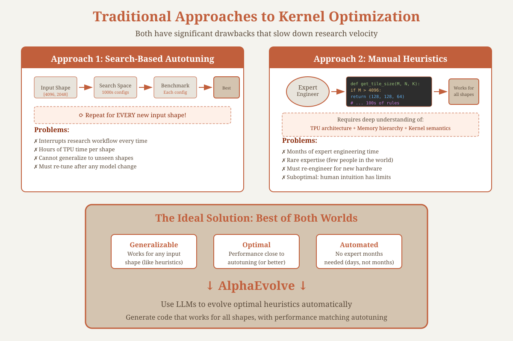

Gemini is built on JAX and uses Pallas kernels for performance-critical operations. One target kernel is matrix multiplication with configurable tiling.

**Traditional approach 1: Search-based autotuning**
- Try all configurations, keep the best
- Problem: Hours per kernel, must redo for every shape change

**Traditional approach 2: Expert heuristics**
- Engineers write rules based on intuition
- Problem: Months of effort, rare expertise, suboptimal edge cases

Both approaches scale poorly with the number of shapes and kernels.

### The AlphaEvolve Solution

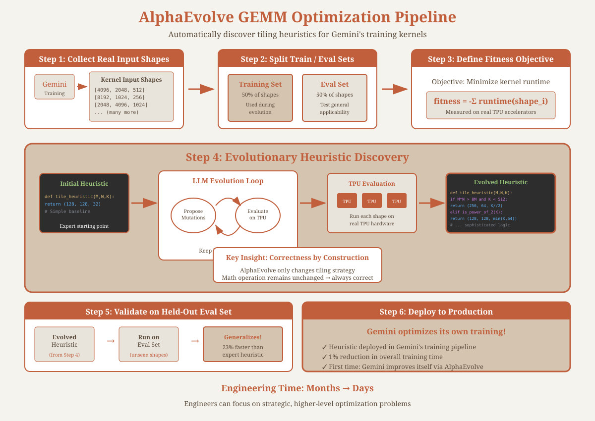

**Step 1: Collect Real Input Shapes**

In the AlphaEvolve paper, the system collected kernel invocation shapes from Gemini training:

```python
# Real shapes from Gemini training
training_shapes = [
    (4096, 2048, 512),    # Attention projection
    (8192, 1024, 256),    # FFN first layer
    (2048, 4096, 1024),   # FFN second layer
    (16384, 512, 128),    # Embedding lookup
    # ... hundreds more
]
```

**Step 2: Split Train/Eval Sets**

50% of shapes are used for evolution (training) and 50% for validation (eval). This tests whether the heuristic generalizes beyond the shapes used during search.

**Step 3: Define Fitness Objective**

```python
def fitness(heuristic_code: str, shapes: List[Tuple]) -> float:
    total_time = 0
    for M, N, K in shapes:
        config = eval_heuristic(heuristic_code, M, N, K)
        runtime = benchmark_kernel(config, M, N, K)
        total_time += runtime
    return total_time
```

**Step 4: Evolve Heuristics**

Starting from a simple baseline:

```python
def get_tile_config(M, N, K, dtype):
    return TileConfig(block_m=128, block_n=128, block_k=32)
```

The LLM proposes changes:

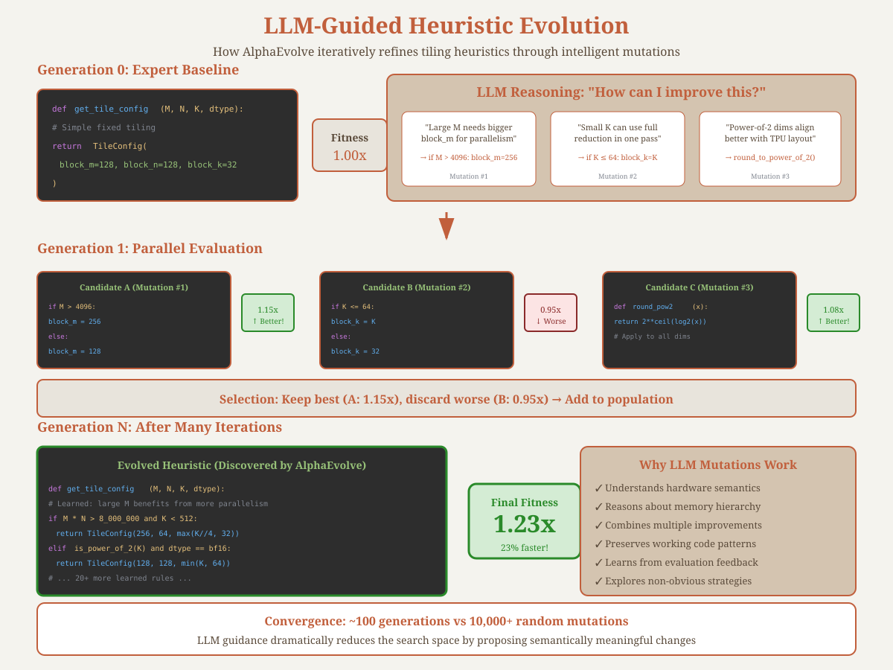

```python
# After evolution
def get_tile_config(M, N, K, dtype):
    # Large M benefits from more parallelism
    if M * N > 8_000_000 and K < 512:
        return TileConfig(block_m=256, block_n=64, block_k=max(K//4, 32))

    # Power-of-2 K aligns with tensor cores
    if is_power_of_2(K) and dtype == bfloat16:
        return TileConfig(block_m=128, block_n=128, block_k=min(K, 64))

    # Small matrices need smaller tiles for occupancy
    if M < 1024 or N < 1024:
        return TileConfig(block_m=64, block_n=64, block_k=64)

    # Memory-bound shapes: prioritize memory efficiency
    if K > 2048:
        return TileConfig(block_m=128, block_n=64, block_k=128, num_stages=4)

    # Default: balanced configuration
    return TileConfig(block_m=128, block_n=128, block_k=64)
```

**Step 5: Validate Generalization**

Run the evolved heuristic on held-out eval shapes:
- Must generalize to unseen shapes
- Must not overfit to training set
- Must maintain correctness

**Step 6: Deploy to Production**

The paper reports deploying the evolved heuristic in Gemini's training pipeline.

### Results

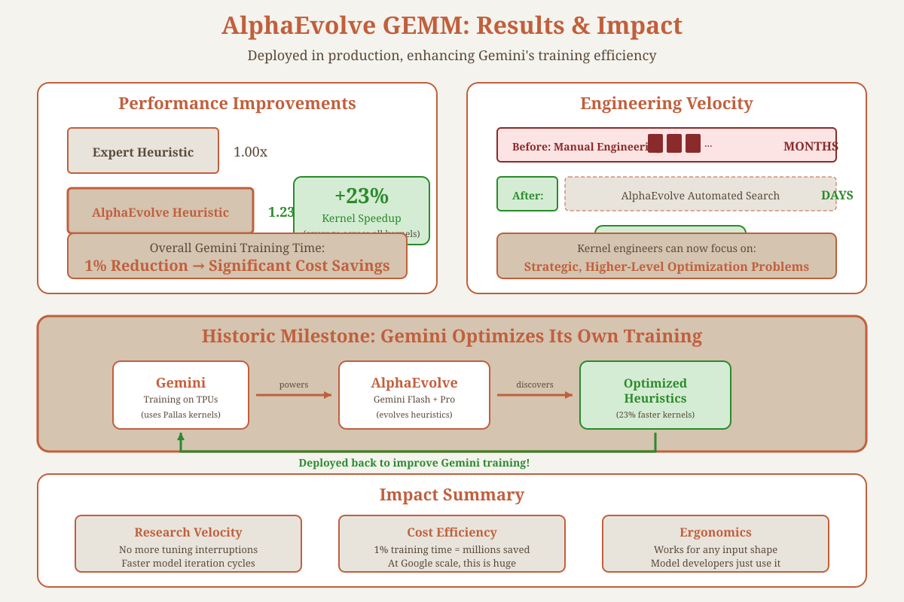

**Performance:**
- **23% average kernel speedup** across all configurations
- Improvement varies by shape: 5% to 40%
- No regressions on any tested shape

**Training Impact:**
- **1% reduction in Gemini's overall training time**
- At Google scale, this represents millions of dollars in compute savings

**Engineering Impact:**
- Development time: **months → days**
- Engineers freed for strategic work instead of manual tuning

**The Self-Improvement Milestone:**

> "This deployment marks a novel instance where Gemini, through the capabilities of AlphaEvolve, optimizes its own training process."

Gemini powered the LLM that discovered heuristics used to speed up Gemini's training.

### Beyond GEMM

The same approach applies to other kernels:

- **Attention kernels**: Flash Attention variants, grouped-query attention
- **Convolutions**: Depthwise, pointwise, dilated
- **Normalization**: LayerNorm, RMSNorm, GroupNorm
- **Activation functions**: GELU, SiLU, custom fusions

The same system and loop can be used with domain-specific context.

---

<a name="future-directions"></a>
## 10. Implications and Future Directions

### The Broader Impact

The AlphaEvolve paper describes a kernel optimization tool and a pattern for AI-assisted programming.

**From search to synthesis:**
- Traditional: Search configuration space with heuristics
- New: LLM synthesizes the heuristics themselves

**From specialized to general:**
- Traditional: Train new model for each domain
- New: Same pre-trained LLM, different prompts

**From code to meta-code:**
- Traditional: Generate optimized code
- New: Generate code that generates optimized configurations

### The Training Data Challenge

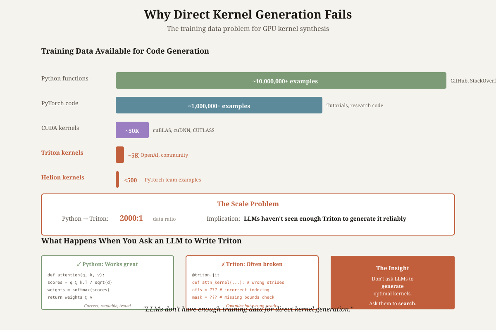

A practical constraint is training data. LLMs are trained on existing code, and high-quality kernel code is scarce. The training data for Triton kernels is smaller than for general-purpose Python. For hardware-specific optimizations, it is smaller still.

OpenEvolve addresses this through:
- **Evolutionary refinement**: Start simple, improve iteratively
- **Evaluation feedback**: Real hardware performance guides search
- **Domain prompts**: Inject knowledge through detailed prompts

Data scarcity limits what LLMs propose. Future work might include:
- **Synthetic data generation**: Generate training data from simulation
- **Active learning**: Focus LLM training on high-value examples
- **Hardware-aware pre-training**: Train LLMs with hardware performance feedback

### The Knowledge Pipeline

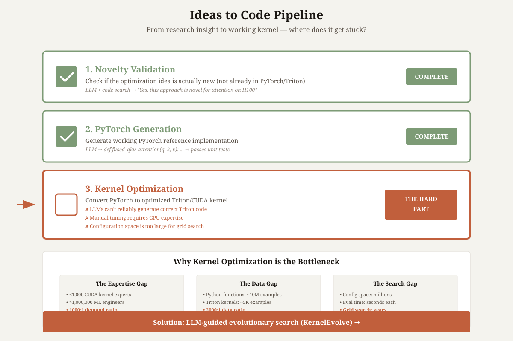

One possible pipeline is:

1. **Research synthesis**: Automatically extract optimization ideas from papers and discussions
2. **Specification generation**: Convert high-level ideas to precise specifications
3. **Implementation**: Generate candidate implementations
4. **Optimization**: Evolve implementations for specific hardware
5. **Deployment**: Automatically integrate into frameworks

Each step can use LLMs tuned for the task.

### Open Questions

**Correctness guarantees:**
- How do we verify evolved kernels are correct beyond testing?
- Can we incorporate formal methods?

**Generalization bounds:**
- When does a heuristic learned on shape set A generalize to shape set B?
- How do we detect overfitting?

**Multi-objective optimization:**
- Performance vs. memory usage vs. power consumption
- How do we navigate trade-off frontiers?

**Hardware co-evolution:**
- Can we evolve hardware designs alongside software?
- What's the right interface between hardware and software search?

### Getting Started

To apply these techniques:

**Start simple:**
1. Identify a kernel with known optimization opportunities
2. Set up reliable benchmarking infrastructure
3. Implement basic evolutionary loop with LLM mutations
4. Iterate on prompt design based on results

**Key success factors:**
- Real hardware evaluation (no simulators)
- Diverse training shapes
- Good baseline to improve from
- Patient iteration on prompts

**Resources:**
- [OpenEvolve](https://github.com/codelion/openevolve): Open-source AlphaEvolve implementation
- [Helion documentation](https://pytorch.org/blog/helion/): PyTorch's kernel DSL
- [Triton tutorials](https://triton-lang.org/): Foundation DSL for GPU programming
- [Fawzi, A., Balog, M., Huang, A. et al. Discovering faster matrix multiplication algorithms with reinforcement learning. Nature 610, 47–53 (2022)](https://doi.org/10.1038/s41586-022-05172-4): AlphaTensor

---

## Conclusion

AlphaTensor targets matrix multiplication factor discovery. The AlphaEvolve paper targets general program optimization using evaluation-guided mutation.

Key points:
1. **LLMs as optimization engines**: Pre-trained models bring domain knowledge to search
2. **Evolution over search**: Iterative refinement beats exhaustive enumeration
3. **Diff over generation**: Targeted changes preserve working code
4. **Heuristics over configurations**: Learning *how* to configure beats learning configurations
5. **Real hardware matters**: No simulator substitutes for actual performance measurement

The method applies in domains where:
- Search spaces are large
- Evaluation is expensive but feasible
- Expert knowledge is scarce
- Solutions are code

...and can use LLM-guided evolutionary optimization.

---

## Appendix: Visualization Index

All visualizations referenced in this post, organized by topic:

### Foundation & Problem
| # | File | Description |
|---|------|-------------|
| 05 | `05_timeline_paper_to_production.svg` | Flash Attention timeline showing research-to-production gap |
| 06 | `06_human_bottleneck_funnel.svg` | Find → Understand → Implement → Optimize funnel |
| 07 | `07_search_space_explosion.svg` | Configuration parameter explosion visualization |
| 08 | `08_self_improvement_loop.svg` | AI optimizing its own infrastructure |

### Computational Basics
| # | File | Description |
|---|------|-------------|
| 03 | `03_matrix_cube_3d.svg` | 3D matrix multiplication visualization |
| 23 | `23_gemm_tiling_problem.svg` | Why tiling matters, trade-offs |
| 12 | `12_strassen_motivation.svg` | CPU cycles: multiplication vs addition |

### Mathematical Framework
| # | File | Description |
|---|------|-------------|
| 13 | `13_tensor_decomposition.svg` | U, V, W tensor decomposition |
| 28 | `28_alphatensor_computation_progression.svg` | Step-by-step mathematical progression |
| 29 | `29_tensor_3d_visualization.svg` | 3D tensor slices and AlphaTensor game |
| 04 | `04_alphatensor_state.svg` | TensorGame board state |

### Helion & Compilation
| # | File | Description |
|---|------|-------------|
| 09 | `09_helion_compilation_pipeline.svg` | Python → TTIR → TTGIR → LLVM → PTX → CUBIN |
| 10 | `10_helion_vs_triton.svg` | Code comparison (30 vs 120 lines) |
| 11 | `11_helion_autotuning.svg` | Search space dimensions |

### DeepMind Evolution
| # | File | Description |
|---|------|-------------|
| 30 | `30_alphatensor_vs_alphaevolve.svg` | Side-by-side system comparison |
| 31 | `31_deepmind_algorithm_evolution.svg` | Timeline: 2022-2025 |
| 32 | `32_architecture_comparison.svg` | RL vs LLM-guided architecture |

### AlphaEvolve Architecture
| # | File | Description |
|---|------|-------------|
| 20 | `20_alphaevolve_architecture.svg` | Four components: DB, Sampler, LLM, Evaluator |
| 21 | `21_alphaevolve_loop.svg` | Evolutionary loop cycle |
| 22 | `22_llm_vs_random_mutation.svg` | Intelligent vs random mutations |

### GEMM Case Study
| # | File | Description |
|---|------|-------------|
| 24 | `24_traditional_approaches.svg` | Autotuning vs manual heuristics |
| 25 | `25_alphaevolve_gemm_pipeline.svg` | Full optimization pipeline |
| 26 | `26_heuristic_evolution.svg` | Code evolution example |
| 27 | `27_gemm_results_impact.svg` | 23% speedup results |

### Knowledge Pipeline
| # | File | Description |
|---|------|-------------|
| 14 | `14_puzzle_pieces.svg` | Section header |
| 15 | `15_frontier_research.svg` | arXiv vs X/Twitter Venn diagram |
| 16 | `16_thread_reconstruction.svg` | Exa + xAI knowledge synthesis |
| 17 | `17_dspy_gap_analysis.svg` | DSPy signature for optimization |
| 18 | `18_ideas_to_code.svg` | Pipeline with gaps |
| 19 | `19_training_data_disparity.svg` | Python vs Triton training data |

### Results
| # | File | Description |
|---|------|-------------|
| 01 | `01_evolutionary_loop.svg` | Core loop overview |
| 02 | `02_results_table.svg` | Benchmark results |

---

*Last updated: December 2025*

---

## Acknowledgments

This post builds on work that was one of the four winning projects in the GPU Mode hackathon, and on follow-on work developed during the xAI hackathon.

The hackathon projects were done in collaboration with Ameen Patel, Emily Shen, Ethan Boneh, and David Andrews. This post is a superset of that work.

## Hackathon Artifacts

- xAI hackathon dashboard (Figma): [Dashboard](https://median-lace-92098579.figma.site/)
- GPU Mode hackathon slides: [Slides](https://docs.google.com/presentation/d/1lCnQtn6q8FckOsCdMwdAJi1rK3XCYY4e8r2xqUttAfg/edit?slide=id.p&pli=1#slide=id.p)

## Bibliography

### BibTeX

```bibtex
@online{rao2025kernelopt,
    author       = {Manoj Rao},
    title        = {LLM-Guided Evolutionary Kernel Optimization: From Research to Production Kernels},
    year         = {2025},
    month        = dec,
    note         = {Last updated: December 2025},
    url          = {https://github.com/mycpuorg/algo-super-intelligence/blob/main/blog_post_llm_kernel_optimization.md}
}
```
