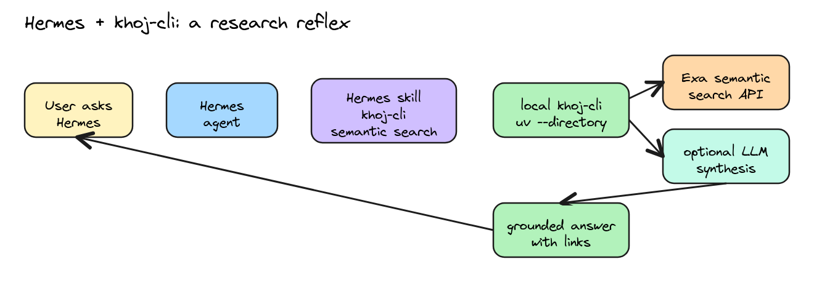
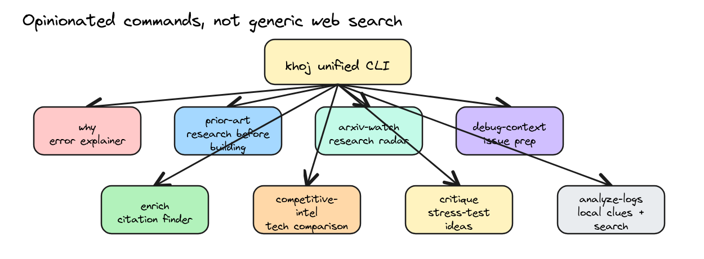
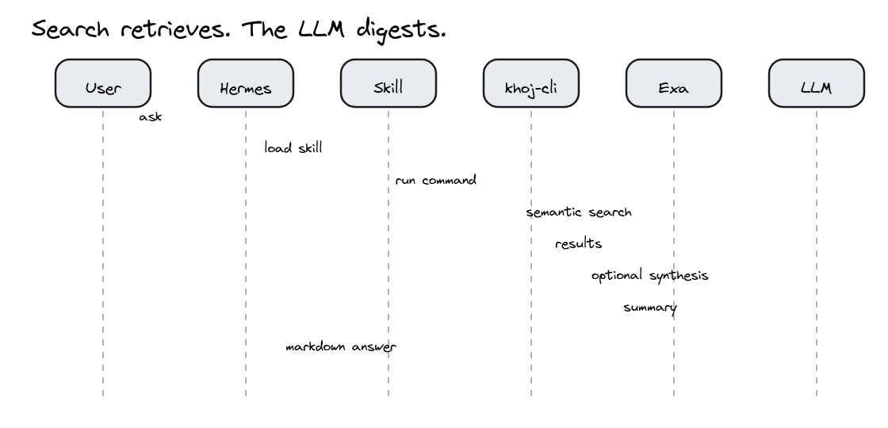
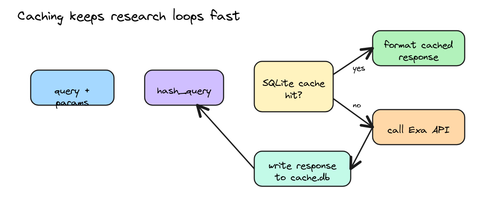
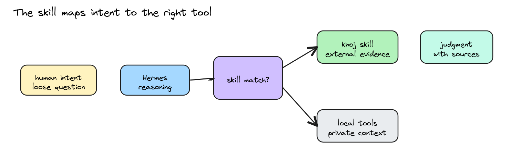
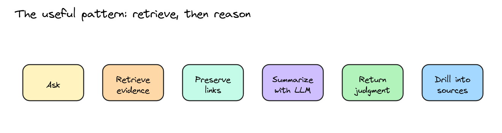

# Hermes Research with khoj-cli

I keep wanting the same thing from an AI assistant: do not just answer from vibes. Go look. Find the source. Compare the claims. Tell me what changed recently. Then give me the short version with links.

That is what this Hermes skill does.

The project is called `khoj-cli`, but the current implementation is really an Exa-backed semantic search toolkit for the terminal. It gives me commands like `why`, `prior-art`, `arxiv-watch`, `competitive-intel`, `enrich`, `critique`, and `analyze-logs`. Each command is opinionated around the kind of work I actually do: GPU systems, distributed training, inference stacks, research papers, benchmark claims, weird runtime failures, and technical writing that needs citations.

The nice part is the Hermes skill. Once the workflow is packaged as a skill, I do not have to remember the command names, flags, repo path, environment variables, or when to use which mode. I can ask Hermes something like:

```text
khoj how MI450 stacks up against Vera Rubin
```

Hermes knows this is a competitive-intelligence query, runs the right CLI command, checks source material, does the synthesis, and hands back a grounded answer. That feels very different from a chatbot guessing from pretraining.

## The shape of the system

At a high level there are three layers:

1. Hermes, which understands my request and decides when the skill applies.
2. The skill document, which teaches Hermes the local workflow: where the repo lives, which commands exist, and how to run them safely.
3. `khoj-cli`, which calls semantic search, caches results, and optionally asks an LLM to synthesize the findings.



Editable Excalidraw version: [source](images/khoj-cli/01-hermes-khoj-system.excalidraw)

The skill is not magic. It is a carefully written `SKILL.md` file. That is the point. It turns a pile of local commands into agent memory.

The important instruction in the skill is:

```bash
uv --directory /path/to/khoj-cli run ...
```

That makes the workflow location-independent. Hermes can be sitting in some other repo, but the command still runs against the right Python project and environment.

## What khoj-cli actually does

`khoj-cli` is a Python CLI package built around a small async client:

```python
class ExaClient:
    BASE_URL = "https://api.exa.ai"
```

The client exposes three primitives:

```text
search(query, num_results, domains, date filters, contents)
get_contents(ids)
find_similar(url)
```

The search call asks Exa for semantic results, not just lexical keyword matches. That matters. If I search for:

```text
RCCL allreduce timeout tensor parallelism MI300X
```

I do not only want pages that contain exactly those words. I want GitHub issues, forum posts, docs, and blog posts that are about the same failure mode, even if they phrase it differently. That is where semantic search earns its keep.

The client requests text and highlights:

```python
"contents": {
    "text": True,
    "highlights": True,
}
```

That gives the downstream formatter and LLM something more useful than a bare URL. A result becomes:

```text
url
title
score
published_date
author
text
highlights
```

Then each command adds its own domain logic.

## The command layer

The commands are small, but they encode taste. That is the difference between "search the web" and "help me do my job".



Editable Excalidraw version: [source](images/khoj-cli/02-command-layer.excalidraw)

A few examples:

`why` is for errors. It reads a query, a file, or stdin. It extracts error patterns, builds a search query, biases toward sources like GitHub, Stack Overflow, PyTorch forums, and AMD docs, and limits to recent results. Then it asks the LLM for a short root-cause summary if an Anthropic key is configured.

```bash
python train.py 2>&1 | uv run khoj why --output markdown
uv run why "RCCL allreduce timeout with tensor parallelism" --num 5
```

`prior-art` searches across categories. Academic domains go one way, code hosting goes another, blogs go another. The command then formats the result as a landscape instead of a flat list of links.

```bash
uv run prior-art "LLM-guided evolutionary kernel optimization" --output markdown
uv run prior-art --code-only "rccl debugging tools" --output json
```

`competitive-intel` is for the question I asked about MI450 versus Vera Rubin. It searches recent sources, caches the result, and can optionally run sentiment analysis over the source snippets.

```bash
uv run competitive-intel \
  --recent \
  --sources 12 \
  --output markdown \
  "AMD MI450 vs NVIDIA Vera Rubin rack scale AI platform"
```

`enrich` is for writing. It finds claims that need citations and searches for supporting sources. This is a nice fit for design docs, blog drafts, and README claims where unsupported factual statements are easy to miss.

`critique` is the most fun one conceptually. Give it a thesis and a domain. It searches for evidence and counterarguments, then produces a more honest read of whether the idea survives contact with reality.

## Where the LLM fits

The LLM is not the search engine. That distinction matters.

Search does retrieval. The LLM does digestion.



Editable Excalidraw version: [source](images/khoj-cli/03-retrieve-then-synthesize-sequence.excalidraw)

In the code, synthesis is intentionally small:

```python
async def summarize(system: str, user: str) -> str:
    settings = get_settings()
    if not settings.anthropic_api_key:
        return ""

    import anthropic
    client = anthropic.AsyncAnthropic(api_key=settings.anthropic_api_key)
    message = await client.messages.create(
        model="claude-sonnet-4-20250514",
        max_tokens=1024,
        system=system,
        messages=[{"role": "user", "content": user}],
    )
    return message.content[0].text
```

If the Anthropic key is missing, commands degrade gracefully. They still return search results. They just skip the synthesis.

I like that design. It keeps the system honest. The source retrieval is one step. The prose summary is another. If the summary is bad, the links are still there.

## Caching, because research loops repeat

Every command that goes out to search computes a hash of the query and relevant parameters, then stores the response in SQLite:



Editable Excalidraw version: [source](images/khoj-cli/04-cache-loop.excalidraw)

The cache lives under the configured cache directory, usually something like:

```text
~/.cache/khoj-cli/cache.db
```

The cache is not just about cost. It makes iterative work nicer. When I am writing, comparing, or debugging, I ask nearby versions of the same question several times. Caching keeps the loop fast enough that I actually use it.

## Why the Hermes skill changes the feel

The CLI is useful on its own. The skill makes it agentic.

Without the skill, I have to remember:

```bash
uv --directory /path/to/khoj-cli run competitive-intel \
  --recent \
  --sources 12 \
  --output markdown \
  "AMD MI450 vs NVIDIA Vera Rubin GPU architecture performance specs memory bandwidth rack scale"
```

With the skill, I can say:

```text
khoj how MI450 stacks up against Vera Rubin
```

Hermes handles the rest.

That is the real product insight here: skills are an interface layer between human intent and tool mechanics. The skill does not just document commands. It tells the agent when to use them, which command fits which kind of question, what output format to prefer, where the repo lives, which environment variables matter, and what not to send to external APIs.



Editable Excalidraw version: [source](images/khoj-cli/05-agentic-skill-routing.excalidraw)

That is why it feels so much nicer inside Hermes. The assistant is not a passive wrapper around a CLI. It is an operator that knows the CLI exists.

## The safety boundary

There is one obvious caveat: external search is external.

The skill explicitly says not to send private logs, secrets, customer data, unreleased code, or sensitive internal context to Exa or Anthropic. If a log file is private, Hermes should summarize or redact locally first, or use local file tools instead.

This is another reason I like having the skill as a written artifact. The safety rules sit next to the command recipes. The agent sees both at the moment it decides what to do.

## Why semantic search beats normal search for this job

Keyword search is fine when you know the exact phrase. It is worse when the thing you want has many names.

GPU and ML systems are full of those cases:

- one GitHub issue says "allreduce hang"
- another says "collective timeout"
- docs call it "communication backend failure"
- a forum post says "training freezes at step 0"
- the fix is hidden under an environment variable name

Semantic search lets the query be a description of the problem rather than a perfect incantation.

That matters even more for research and prior art. A project idea might be called "LLM-guided kernel search" in your head, "program synthesis for tensor programs" in a paper, "autotuning with learned cost models" in another, and "evolutionary search over Triton kernels" in a repo. A lexical search misses too much unless you already know the field. Semantic search gives you more chances to discover the vocabulary you did not know yet.

## The useful pattern: retrieve, then reason

The design is simple, but it is the pattern I want more agent tools to use:



Editable Excalidraw version: [source](images/khoj-cli/06-retrieve-reason-pattern.excalidraw)

Do not ask the LLM to remember everything.

Ask search to retrieve current, source-linked evidence. Then ask the LLM to compress it, compare it, and explain the tradeoffs. Keep the URLs attached so the human can verify the answer.

That is exactly what happened in the MI450 versus Vera Rubin example. The answer was useful because it combined:

- AMD's own MI450/Helios numbers
- NVIDIA's Vera Rubin NVL72 specs
- recent third-party coverage
- a bit of arithmetic on memory and bandwidth ratios
- judgment about software maturity and ecosystem risk

The answer was not just "AMD has more memory, NVIDIA has more software." It gave the actual shape of the comparison.

## Why I like this as an agent skill

Skills are underrated. Everyone wants agents to learn, but most "learning" gets fuzzy fast. A Hermes skill is boring in the best way: it is a versioned markdown file with commands, paths, recipes, caveats, and trigger conditions.

That gives you a few nice properties:

- It is inspectable. You can read what the agent thinks the workflow is.
- It is editable. If the command changes, patch the skill.
- It is portable. Install the skill on another machine and the agent gets the workflow.
- It is composable. Hermes can combine this with file tools, terminal tools, browser tools, session search, cron jobs, and subagents.
- It is safer than memory alone. Procedures live in a skill instead of becoming vague remembered lore.

For agentic use, this is the sweet spot. The human asks a loose question. Hermes maps it to a real tool. The tool retrieves evidence. The LLM digests it. Hermes turns it into an answer with judgment.

That is the kind of assistant I want: not omniscient, but resourceful.

## The commands I use most

```bash
# Raw semantic search
uv --directory /path/to/khoj-cli run khoj search \
  "query" --num 10 --output markdown

# Explain an error
uv --directory /path/to/khoj-cli run why \
  "RCCL allreduce timeout with tensor parallelism" --num 5 --output markdown

# Check whether an idea already exists
uv --directory /path/to/khoj-cli run prior-art \
  "LLM-guided evolutionary kernel optimization" --output markdown

# Track papers/blogs/repos around a topic
uv --directory /path/to/khoj-cli run arxiv-watch \
  "speculative decoding LLM inference" --output markdown

# Compare two technologies
uv --directory /path/to/khoj-cli run competitive-intel \
  --recent --sources 12 --output markdown \
  "MI450 vs Vera Rubin rack scale inference"

# Find citations for a claim or draft
uv --directory /path/to/khoj-cli run enrich \
  "Speculative decoding reduces latency by 2-3x" --inline

# Stress-test a thesis
uv --directory /path/to/khoj-cli run critique \
  --domain "GPU kernels" \
  "Custom CUDA kernels always outperform Triton"
```

Inside Hermes, I usually do not type those. I just say `khoj ...` and let the skill route the request.

## Closing thought

A lot of AI tooling is trying to make models bigger, more autonomous, or more magical. This goes the other direction. It gives the agent a small, sharp tool and a good instruction manual.

That turns out to be enough.

Hermes already has tools, memory, sessions, cron jobs, and skills. `khoj-cli` adds a research reflex: when the question depends on the outside world, go retrieve evidence first. Then reason.

That is a much better default than answering from memory and hoping the vibes are current.
