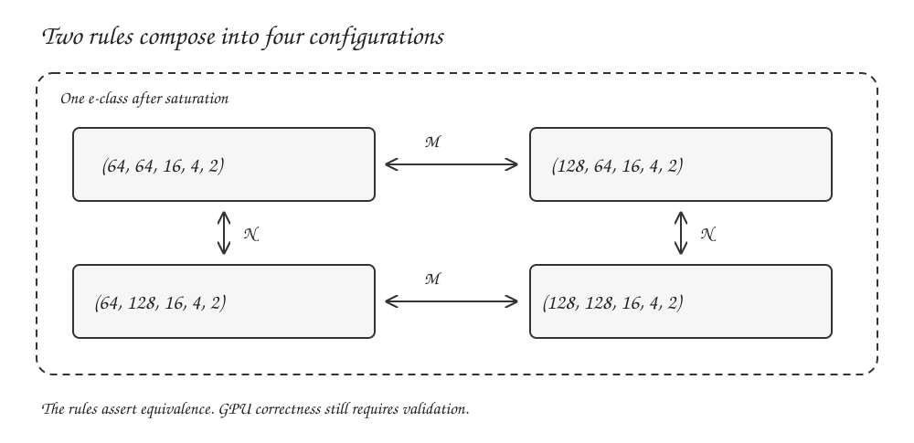
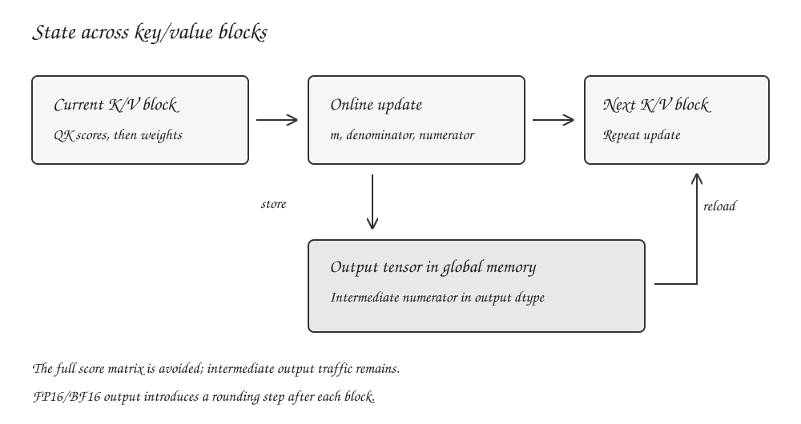
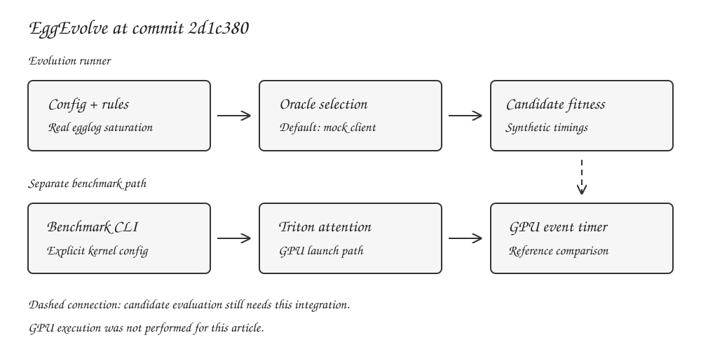

_Equality saturation, streaming attention, and measured extraction_

A GPU kernel optimizer must generate candidate implementations, establish which candidates satisfy the operation's contract, and measure their cost on a particular device. These tasks require different kinds of evidence. A rewrite establishes a relationship between expressions. A numerical test checks selected inputs. A timer measures an executable under a particular workload.

[EggEvolve](https://github.com/mycpuorg/eggvolve) explores how equality saturation and an evolutionary search loop could cooperate on GPU kernel optimization. The implementation starts with a finite set of tile and launch parameters. Egglog derives related configurations, and Python reconstructs them for candidate selection.[1][2]

This article examines commit `2d1c380bd00e41365acaba001970690ab7e24a9c`. The CPU e-graph path works. A separate Triton attention implementation and benchmark CLI exist. The evolution runner still uses a mock selection client, self-comparison for candidate validation, and synthetic candidate timings. It cannot yet establish a kernel speedup.[2][3][4]

The distinction determines what we can learn from the repository. We can run configuration closure, explain the attention recurrence, and trace the interfaces that a measured optimizer needs. We cannot report the project's performance targets as achieved results.

The [previous post on tensor equations](2026-09-13-from-tensor-equations-to-fast-kernels.md) described a possible compiler that searches over attention algorithms. This article examines the smaller implemented search space and the work required to connect it to that compiler design.

## 1. Define the optimization problem

Let $P$ denote an operation with an explicit semantic contract. Let $x$ describe a workload, including tensor shapes and layouts. Let $h$ describe the hardware and compiler environment. A parameter vector $\theta$ determines a candidate implementation $K_\theta$.

A useful optimization problem is

$$
\theta^* = \underset{\theta \in \Theta(P,x,h)}{\operatorname{argmin}}
\; T(K_\theta,x,h),
$$

subject to

$$
\operatorname{Legal}(K_\theta,x,h)
\quad\text{and}\quad
\operatorname{Accept}(K_\theta,P,x).
$$

Legality includes valid memory accesses and launch dimensions. Acceptance includes output shape, dtype, masking behavior, and an error criterion. Runtime $T$ comes from measurement or a cost model whose limitations we understand.

The workload belongs in this formulation. A tile that works well for long-sequence prefill can perform poorly for a single query. A layout that makes one operand contiguous can make another operand expensive to load. Compiler version and precision settings can change the generated instructions.

There are also different levels of candidate generation:

| Search level         | Example decision                                 | Required representation                |
| -------------------- | ------------------------------------------------ | -------------------------------------- |
| Launch configuration | Query tile size or number of warps               | Parameters for an existing kernel      |
| Schedule             | Loop order, buffering, workgroup ownership       | Loops and memory placement             |
| Algorithm            | Materialized attention or online attention       | Tensor semantics and state transitions |
| Arithmetic           | Precision, reduction tree, approximate operation | Numerical contract and error analysis  |

EggEvolve's current e-graph represents the first level. Its datatype contains five integers. It does not contain tensor operations or the body of the attention kernel.[1]

That scope makes the CPU component easy to exercise. It also makes exhaustive configuration enumeration a necessary comparison when evaluating whether the e-graph or a learned selector adds value.

## 2. E-graphs retain equivalent expressions

An ordinary expression tree records a particular construction. An e-graph groups expressions that the system has established as equivalent. Each group is an _e-class_. An _e-node_ records an operator whose children refer to e-classes.[10]

Consider symbolic arithmetic over mathematical integers:

$$
x + 0 \equiv x.
$$

After applying this identity, an e-class can contain both the variable and an addition node. A larger expression can refer to that class without choosing either representation immediately.

For example,

$$
f(x+0) \equiv f(x).
$$

This follows from congruence: replacing a child with an equivalent child preserves the enclosing expression's meaning. E-graphs maintain that relationship as classes merge.[10]

A simplified view is:

```text
class X:      { variable("x"), add(X, ZERO) }
class ZERO:   { integer(0) }
class RESULT: { f(X) }
```

The cycle in class `X` is permitted. It can represent arbitrarily nested additions of zero using a finite graph. An extractor must choose a finite representative under its cost policy.

Equality saturation repeatedly matches rules, adds their consequences, and merges classes. Extraction then chooses a representative. The `egg` work describes rebuilding as a way to restore e-graph invariants efficiently across these batches, and e-class analyses as a way to attach domain-specific information to classes.[10]

The rules define the reachable alternatives. Resource limits can stop exploration before a fixed point. E-graphs therefore provide neither unlimited search nor a guarantee that every semantically equivalent implementation has been represented.

### Rewrite direction and retained alternatives

A rewrite such as

```text
x + 0  ->  x
```

controls how a match generates a consequence. Within equality saturation, the matched and generated expressions become equivalent; the original expression remains represented. A bidirectional rewrite also enables matching in the reverse direction. This matters when the initial expression appears on either side of a rule.

Retaining alternatives reduces the need to commit to a destructive sequence of transformations. It does not remove the cost of matching rules, storing derived nodes, or deciding when to stop.

### Equality depends on the arithmetic model

Integer identities need integer semantics. A mathematical identity involving real addition cannot automatically become a rewrite for strict floating-point addition.

For instance,

$$
(a+b)+c \ne a+(b+c)
$$

can hold in floating-point arithmetic. The accompanying CPU script uses float32 values $a=10^{20}$, $b=-10^{20}$, and $c=3.14$. It obtains approximately `3.140000104904175` on the left and `0.0` on the right.

Reassociation changes rounding. Quantization changes the represented values. An optimizer must encode the allowed arithmetic behavior before treating either transformation as an equality.

## 3. Egglog adds relational reasoning

Egglog combines equality saturation with Datalog-style reasoning. It supports term rewriting and congruence closure alongside incremental execution, cooperating analyses, and lattice-based information.[11]

That combination is relevant to compilers because many transformations require facts beyond the syntactic shape of an expression. A compiler may need to establish a dimension, an alignment property, or the absence of a conflicting memory effect before applying a rule.

A future tiling system could require facts such as:

```text
operation has a reduction axis of extent K
candidate tile covers every output coordinate
tail accesses are masked
scratch allocation fits the target's workgroup budget
```

These are proposed analysis facts. EggEvolve's current configuration rules do not derive them.

The Python package exposes both a Python expression interface and low-level bindings. EggEvolve uses `egglog.bindings.EGraph` and native egglog program strings. Its wrapper parses a program and executes the returned commands.[1][7]

The basic setup is:

```python
from egglog.bindings import EGraph

graph = EGraph()
commands = graph.parse_program(
    "(datatype TileConfig (config i64 i64 i64 i64 i64))"
)
graph.run_program(*commands)
```

The five integer fields are ordered as follows:

```text
(config BLOCK_M BLOCK_N BLOCK_K num_warps num_stages)
```

At this layer, those integers have no attached tensor semantics. Egglog knows the declared datatype and the supplied relationships. The kernel implementation must give the tuple its operational meaning.[1]

## 4. Trace one configuration through saturation

Start with

```text
(config 64 64 16 4 2)
```

This names a query tile of 64 and a key/value tile of 64, with the remaining tuning coordinates fixed for this example. The correspondence between `BLOCK_K` and the attention implementation's `BLOCK_HEADDIM` still requires an adapter; they are different field names in the two interfaces.[1][3]

Now register two rules:

```lisp
(birewrite
  (config 64 ?n 16 4 2)
  (config 128 ?n 16 4 2))

(birewrite
  (config ?m 64 16 4 2)
  (config ?m 128 16 4 2))
```

The first rule changes the M coordinate while preserving N. The second changes N while preserving M. Applying both generates the combined alternative.



The executable example uses EggEvolve's wrapper:

```python
from eggevolve.core.e_graph import EGraphWrapper, TileConfig

graph = EGraphWrapper()
graph.register_config(TileConfig(64, 64, 16, 4, 2))
graph.add_rules([
    "(birewrite (config 64 ?n 16 4 2) (config 128 ?n 16 4 2))",
    "(birewrite (config ?m 64 16 4 2) (config ?m 128 16 4 2))",
])
graph.saturate(iterations=10)

for config in sorted(c.to_egglog() for c in graph.get_all_configs()):
    print(config)
```

The companion script checks the resulting tuples against an independently constructed Cartesian product. It finds:

```text
(config 64 64 16 4 2)
(config 64 128 16 4 2)
(config 128 64 16 4 2)
(config 128 128 16 4 2)
```

These alternatives belong to one e-class. Configuration count and e-class count measure different things. In particular, `EGraphWrapper.saturate()` returns the number of `TileConfig` classes found in the serialized graph.[1]

### Full architecture-specific closure

The factory functions supply larger coordinate sets:[1]

| Coordinate   | RDNA4 factory | CDNA4 factory |
| ------------ | ------------- | ------------- |
| `BLOCK_M`    | 32, 64, 128   | 64, 128, 256  |
| `BLOCK_N`    | 32, 64, 128   | 64, 128, 256  |
| `BLOCK_K`    | 16            | 16, 32        |
| `num_warps`  | 4, 8          | 4, 8, 16      |
| `num_stages` | 2, 3          | 2, 3, 4       |

For the seed `(config 64 64 16 4 2)`, the independent product check gives

$$
|\Theta_{\mathrm{RDNA4}}|=3\cdot3\cdot1\cdot2\cdot2=36,
$$

$$
|\Theta_{\mathrm{CDNA4}}|=3\cdot3\cdot2\cdot3\cdot3=162.
$$

The local CPU run recovered exactly those sets, each in one e-class. This is a verified statement about configuration generation. It establishes neither compilation success nor numerical correctness for those configurations.

The coordinate sets are project search policies. They should not be read as a complete specification of legal tile shapes on either architecture. Hardware support depends on the operation, datatype, compiler lowering, and resource usage.

## 5. Configuration equivalence is an assertion

The configuration datatype omits the program to which a tuple applies. A rule connecting two tuples therefore encodes an assumption that both parameterizations preserve the intended computation.[1][6]

For that assumption to hold, the kernel must handle every output coordinate correctly under both configurations. Changing a tile size must preserve bounds checks. Changing the reduction partition must obey the numerical contract. Increasing workgroup resources must remain legal on the selected device.

The current rules do not check those properties. `register_config()` accepts a tuple and inserts it. Pattern variables can preserve values outside the advertised coordinate sets. For example, the RDNA4 rules require K to equal 16; a seed with K equal to 32 does not match those rules.[1]

The graph can consequently contain an isolated unsupported tuple or a family that retains an unexpected wildcard coordinate. Candidate generation and legality checking need separate interfaces.

A stronger representation would make the computation and contract explicit:

```text
Candidate(problem_id, semantic_contract, schedule, target)
```

A validator could then check whether each candidate is legal for that problem. The e-graph would contain equivalences justified within the declared contract.

Approximate arithmetic requires additional care. The relation “within a tolerance” is generally not transitive: two individually acceptable changes can accumulate an unacceptable error. Unioning approximate alternatives into an equality class can therefore lose information. Approximate transforms need explicit error accounting or a separate candidate relation, followed by validation against the original reference.

### The current search is small enough for a direct baseline

The configuration alternatives form a finite Cartesian product. A Python product iterator can enumerate the same set. The design log explicitly discusses the overhead of using an e-graph for this stage and defers program-level rewriting.[6]

An experiment should compare direct enumeration with the e-graph path under the same legality filter. If both yield identical candidates, differences in performance will come from candidate ordering, measurement policy, or overhead.

E-graphs become more useful when rules compose over structured programs, share subexpressions, or depend on derived facts. A flat configuration tuple offers less opportunity for that sharing. The current implementation provides a place to test the interfaces before introducing a richer language.

## 6. Extraction crosses several interfaces

EggEvolve serializes the graph, visits nodes whose operator is `config`, and groups them by their e-class identifier. It reconstructs each integer field by looking up the node's primitive children. It then exposes classes as dictionaries containing IDs and member strings.[1]

This path enumerates represented configurations. It does not invoke a hardware cost model to extract a minimum-cost program.

The distinction becomes more substantial for a future expression language. A common tree cost has the form

$$
C(n)=c_{\mathrm{op}}(n)+\sum_{e\in\operatorname{children}(n)}C(e).
$$

That model can rank arithmetic expressions when costs are approximately compositional. GPU costs often depend on choices across the expression. Fusion can save a write while extending live ranges. A larger tile can increase reuse while reducing occupancy. A layout selected for one operation can impose a conversion on its consumer.

Measured extraction must account for those interactions. One possible implementation would generate a shortlist using static estimates, compile the shortlist, and feed measured costs back into selection. This is proposed work for EggEvolve.

### Rule loading has multiple sources

The repository stores configuration rules in `.egg` files, factory functions, and backend methods. The evolution runner obtains its rules from `backend.get_optimization_rules()`. Editing a rules file alone does not update that path.[1][2]

This duplication creates a reproducibility problem. A result should identify the rules actually loaded, preferably by a content hash. Consolidating rule ownership would prevent the tutorial, factories, and runner from silently exploring different spaces.

Rule failure also needs an explicit policy. `add_rules()` logs a malformed rule and continues, whereas file loading raises an exception. A successful run can therefore use fewer rules than the caller intended.[1]

For an experiment, loading failures should either stop the run or appear in its result metadata. Otherwise a reduced candidate set can look like an intentional search decision.

## 7. The attention operation being tuned

The implemented kernel computes dense, noncausal forward attention. Its interfaces use

$$
Q\in\mathbb{R}^{B\times H\times M\times D},
\qquad
K,V\in\mathbb{R}^{B\times H\times N\times D}.
$$

For one batch and head,

$$
S_{ij}=\frac{1}{\sqrt D}\sum_{d=0}^{D-1}Q_{id}K_{jd},
$$

$$
P_{ij}=\frac{e^{S_{ij}}}{\sum_{k=0}^{N-1}e^{S_{ik}}},
\qquad
O_{id}=\sum_{j=0}^{N-1}P_{ij}V_{jd}.
$$

The source includes sequence-boundary masking. It has no causal-mask input, dropout path, or backward implementation.[3]

A materialized implementation writes a score or probability tensor with $BHMN$ elements. For $B=1$, $H=32$, and $M=N=4096$, one FP16 matrix occupies 1 GiB. That figure covers a single matrix; allocator behavior and the rest of the program determine peak memory. The companion script verifies the byte arithmetic.

FlashAttention uses tiling and an online normalization algorithm to reduce transfers between GPU memory and on-chip storage.[8] EggEvolve's attention kernel uses the same mathematical recurrence, with a different storage choice for the partial output.[3] Triton's fused-attention tutorial provides a separate FlashAttention-v2 implementation for comparison.[13]

### Derive the online state

For one query row, let $s_j$ be its scores and $v_j$ its value vectors. Maintain

$$
m=\max_{j\in A}s_j,
\qquad
\ell=\sum_{j\in A}e^{s_j-m},
\qquad
u=\sum_{j\in A}e^{s_j-m}v_j
$$

for the keys $A$ processed so far. The final output is $u/\ell$.

For a new block $J$, define

$$
\begin{aligned}
m' &= \max\left(m,\max_{j\in J}s_j\right),\\
\alpha &= e^{m-m'},\\
p_j &= e^{s_j-m'},\\
\ell' &= \alpha\ell+\sum_{j\in J}p_j,\\
u' &= \alpha u+\sum_{j\in J}p_jv_j.
\end{aligned}
$$

The factor $\alpha$ converts the old sums to the scale defined by the new maximum. Every old contribution becomes $e^{s_j-m'}$ after rescaling, so the updated sums have the required meaning.

Initialize $m=-\infty$, $\ell=0$, and $u=0$. A nonempty first block with finite scores gives a finite new maximum and zero weight for the empty old state. Empty inputs and fully masked rows require their own defined behavior; the recurrence alone does not settle those API cases.

### A numerical example

Use scores $[0,1,2,3]$, scalar values $[1,2,4,8]$, and two blocks. The CPU example produces:

| Keys processed | Running maximum $m$ | Denominator $\ell$ | Numerator $u$ |
| -------------- | ------------------- | ------------------ | ------------- |
| First two      | 1                   | 1.3678794412       | 2.3678794412  |
| All four       | 3                   | 1.5530017928       | 9.7919753995  |

Both the online calculation and the direct normalized weighted sum return `6.305192592227569` in the float64 check.

This verifies the worked arithmetic. It does not test the Triton kernel, whose intermediate precision and storage behavior differ from the CPU example.

## 8. Map the recurrence onto the kernel

Each Triton program owns one query tile and one batch/head pair. The launch grid is

$$
\left(\left\lceil\frac{M}{B_M}\right\rceil,\; BH\right).
$$

The program decomposes the second program ID into a batch index and head index. Q, K, V, and output pointers all use that same head index.[3]

For each key/value block, the kernel accumulates a $B_M\times B_N$ score tile in FP32. It traverses the head dimension in chunks controlled by `BLOCK_HEADDIM`, which the configuration fixes at 16. Each chunk contributes a `tl.dot` result. After applying the score scale and masks, the kernel updates the row maximum and denominator.[3]

The weights then multiply the corresponding V tiles. The output dimension is also traversed in chunks. The source contains the mathematical pieces needed to avoid materializing the full attention matrix.

### Partial output goes through global memory

The implementation writes the unnormalized numerator to the output tensor after each key/value block. The next block reloads that tensor and rescales it. The wrapper allocates output with `torch.empty_like(q)`, so FP16 input gives an FP16 intermediate output buffer.[3]



This choice reduces the amount of output state that must remain live in registers. It also introduces repeated rounding and global-memory accesses. Converting the reloaded value to FP32 cannot recover bits lost in the previous store.

Let

$$
T=\left\lceil\frac{N}{B_N}\right\rceil,
\qquad
E=BHMD.
$$

For nonempty input, the source-level output-buffer traffic consists of $T$ intermediate stores, $T-1$ intermediate reloads, and a final normalization read and write. If each output element occupies $s$ bytes, this totals

$$
(2T+1)Es
$$

logical bytes accessed through the output pointer.

For the earlier sequence shape with $D=128$ and $B_N=64$, the output occupies 32 MiB and the loop has 64 key/value blocks. The expression gives 4,128 MiB of logical output traffic. Caches can serve some of those accesses; this is not a measurement of external-memory traffic.

A candidate that retains an FP32 numerator on-chip could reduce these transfers and repeated low-precision rounding. Its larger live state could also increase register pressure. Comparing those schedules requires compiled resource information and device measurements.

The source also loads Q inside the key/value loop. Comments about keeping Q in registers, generating a particular matrix instruction, or using a specific memory transaction size do not establish what the compiler emits. Those claims require compiler dumps or profiling.[3]

### Tile sizes interact with resource use

Increasing $B_M$ gives a program more query rows to process. Increasing $B_N$ changes the size of its score tile and the number of loop iterations. The score tile contains $B_MB_N$ values before considering the compiler's distributed layout.

Larger tiles can increase reuse, but they also change live ranges, synchronization, and per-workgroup resources. Adding warps changes how work is distributed. Pipeline stages can change buffering and overlap. These effects prevent a tile-size preference from becoming a universal performance rule.

The current e-graph rules do not model these resource interactions. The separate Triton autotuner has its own pruned candidate list, so it also explores a different set from the e-graph factory.[1][3]

## 9. Tail predicates must depend on the selected candidate

The fixed-configuration wrapper computes divisibility using the actual tile sizes:[3]

```python
EVEN_M = M % config.BLOCK_M == 0
EVEN_N = N % config.BLOCK_N == 0
```

The autotuned wrapper instead computes both predicates using 32, before the tuner selects a candidate.[3]

```python
EVEN_M = M % 32 == 0
EVEN_N = N % 32 == 0
```

Candidates include larger tiles. For a sequence length of 96, the CPU predicate check gives:

| Tile size | `96 % 32 == 0` | Divisible by selected tile? | Tail positions beyond 96 |
| --------- | -------------- | --------------------------- | ------------------------ |
| 32        | True           | True                        | 0                        |
| 64        | True           | False                       | 32                       |
| 128       | True           | False                       | 32                       |

The kernel uses these flags to select unmasked loads and stores. A flag derived from the smallest tile can therefore permit out-of-bounds accesses for a larger candidate. This is a source-derived defect supported by a CPU check of the predicates; it was not reproduced on a GPU for this article.

A repair should derive the predicates from each selected candidate or retain masks until candidate-specific divisibility is established. Tests should include dimensions that are multiples of 32 without being multiples of every candidate tile.

This defect also explains why configuration equality needs a program-level contract. The tuple itself carries no evidence that the wrapper calculated valid bounds predicates.

## 10. GQA requires a different head mapping

Grouped-query attention uses fewer K/V heads than query heads. If $H_Q$ is divisible by $H_{KV}$, define

$$
g=H_Q/H_{KV},
\qquad
h_{KV}=\left\lfloor h_Q/g\right\rfloor.
$$

Q uses head $h_Q$, while K and V use $h_{KV}$. A native implementation must encode that mapping in its addresses.

EggEvolve's kernel uses the same head index for all three tensors.[3] The repository's GQA-shaped test expands K and V with `repeat_interleave` before launching the kernel. That tests dense attention on expanded inputs. It does not establish native grouped-head indexing or preservation of the smaller K/V storage footprint.[14]

A native GQA extension would need separate head-count parameters and validation of their relationship. It would also need tests against an expanded reference without requiring expansion in the candidate itself.

Input validation deserves attention before such an extension. The current wrappers check rank, head dimension, and K/V sequence length, but omit explicit checks for matching batch/head counts, dtype, and device.[3] Unequal-head tensors should be rejected until the implementation supports their semantics.

## 11. The evolution runner's current behavior

The runner initializes an e-graph, measures a reference baseline, saturates the graph, requests candidates, and assigns fitness. It then performs selection and mutation until a stopping condition applies.[2]



The default client is `MockLLMClient`. It samples hardcoded parameter choices and returns synthetic expression names. The model setting does not instantiate a provider. The CLI explicitly supplies this mock client.[2][5]

Candidate validation contains:

```python
variant_output = ref_output  # Placeholder
```

Candidate timing derives its result from the measured baseline:

```python
variation = random.uniform(0.8, 1.2)
median_ms = base_time * variation
```

The remaining timing statistics and TFLOPS are also constructed values. The evaluator never launches the candidate in this path.[2]

These placeholders let developers exercise control flow, but their output cannot support a performance result. Reference timing being real does not make the candidate measurements real.

### A selector must return members of the supplied search space

The oracle interface accepts class IDs, expression strings, and configurations. Its validator checks tile sizes through the backend. It does not verify that the returned expression belongs to the named class or that the configuration agrees with that expression.[2]

A proposed selector contract should use a stable candidate ID:

```json
{ "candidate_ids": ["candidate_017", "candidate_004"] }
```

The runner would resolve those IDs through its own immutable candidate registry. It would reject unknown IDs and deduplicate repeated selections before benchmarking. A model could provide reasoning in a separate field, without using that text to construct executable parameters.

The prompt currently displays a limited prefix of classes and members. Any evaluation of a real selector should distinguish the represented search space from the subset actually shown to the model.[2]

### Mutation must change the represented candidate

The current mutation code constructs expression strings such as `mutate-warps` wrappers. Reinsertion passes those strings through a parser that recognizes a configuration expression or JSON and otherwise returns an architecture default.[2]

The mutation therefore fails to express the intended change in the configuration graph. A direct typed transformation on `TileConfig`, followed by validation and registration, would make that stage inspectable.

The loop also collects elites without explicitly carrying those variant objects into the next freshly extracted population. Checkpoints save summaries rather than complete graph and random-generator state. Their present role is reporting; exact continuation needs more state and a corresponding loader.[2]

### Fitness should match the experiment

The implemented score is

$$
F=0.7\frac{t_{\mathrm{baseline}}}{t_{\mathrm{median}}}
+0.2\frac{t_{\mathrm{median}}}{t_{99}}
+0.1(1+\eta),
$$

where $\eta$ is a capped throughput ratio using a rough peak estimate based on the number of compute units.[2]

The formula mixes latency, a tail ratio, and throughput. For the current synthetic evaluator, none of those candidate terms are measurement evidence. Even after wiring real execution, the throughput normalization would need a defensible hardware model.

A first measured experiment can use median latency as the objective, with correctness as a hard admission condition. Tail behavior can be reported separately. This makes it easier to determine whether a selected candidate actually improves the intended workload.

## 12. A benchmark needs an explicit contract

The separate benchmark CLI launches the attention wrapper and times it with GPU events. It performs warmup, synchronizes each measured sample, and compares candidate and reference results. The reference is eager PyTorch matmul, softmax, and matmul.[3][4]

A speedup against that reference answers a narrower question than a comparison with PyTorch SDPA or an optimized FlashAttention implementation. A published result must name the baseline and its settings.

The CLI computes attention throughput using

$$
\operatorname{FLOPs}=4BHMND,
$$

which counts the two matrix products and excludes softmax. The resulting TFLOPS value is an operation-count convention divided by runtime.[4]

Several behaviors need correction before using the CLI as an automated acceptance gate:

- A failed correctness check is recorded, but timing continues.
- Disabling validation leaves `correct` initialized to true.
- The reported median uses the upper middle sample for an even sample count.
- JSON output lacks actual device identity, software versions, input seed, raw samples, and the selected autotune configuration.[4]

A robust result should distinguish `passed`, `failed`, and `not_run` validation states. Invalid candidates should never enter the performance ranking.

### Correctness matrix

Validation should cover the supported API, including awkward boundaries. For this attention implementation, useful dimensions of the test matrix include:

| Dimension        | Cases to exercise                                                     |
| ---------------- | --------------------------------------------------------------------- |
| Sequence lengths | Below a tile, exact tiles, irregular tails, asymmetric M/N            |
| Head dimension   | Supported dimensions and nonaligned tails                             |
| Layout           | Contiguous tensors and supported strided views                        |
| Dtype            | Each advertised input and accumulation format                         |
| Values           | Random inputs, large score ranges, repeated values, cancellation      |
| Interface errors | Unequal heads, unequal batches, mixed devices, invalid configurations |
| Mask behavior    | Dense behavior now; explicit causal and empty-row behavior if added   |

Use a higher-precision reference where practical. Record absolute and relative errors, including nonfinite outputs. Preserve the failing input or its seed and generation procedure.

Random testing complements a semantic argument. It cannot establish universal equivalence, and a rule declaration cannot replace executable tests.

### Timing matrix

Measure a fixed compiled candidate after warmup. Record whether allocation occurs inside the measured callable, whether the measurement includes multiple launches, and how synchronization is performed. Treat compilation and tuning latency as separate costs.

Repeated sweeps help detect drift from thermals or other workloads. Interleaving baseline and candidate measurements reduces dependence on a single earlier baseline. Keep raw samples so the estimator and uncertainty can be recomputed.

For configuration search, cache measurements under a key that includes the program, full configuration, workload, compiler settings, and actual device. Reusing a timing under an incomplete key can make the optimizer select a candidate based on a different experiment.

## 13. Where an LLM could help

A learned selector could prioritize candidates when compilation and measurement dominate the search budget. Its input could include workload dimensions, candidate resource estimates, and previous measurements. Its output would be an ordering or a bounded shortlist.

For EggEvolve's present finite spaces, test that hypothesis against direct enumeration and random selection. Exhaustive measurement can provide an empirical reference optimum once every legal candidate is executable.

A useful experiment fixes a measurement budget $b$ and compares the best valid latency found by each selector. It should also report wall-clock search cost, because model requests and compilation consume time beyond GPU execution.

For example, define

$$
R_b=\frac{T_{\mathrm{best\ found\ within}\ b}}{T_{\mathrm{best\ measured\ over\ legal\ space}}}.
$$

Values near one indicate that the selector found a candidate close to the best measured result in that finite space. Repeat the experiment across seeds and workloads. Hold out some shapes when assessing whether the selector generalizes beyond its history.

The comparison should use the same candidate registry and evaluator. Otherwise an apparent gain can come from a different search space or baseline.

OpenEvolve provides a separate implementation of LLM-guided evolutionary code search.[12] EggEvolve's runner is currently local scaffolding with an intended integration direction. Importing a concept or naming a module after an approach does not establish that the external system is executing in the measured path.

## 14. Moving from configurations to program transformations

The repository's design log separates configuration exploration from a future IR stage. That stage requires a program representation, a parser or exporter, and code generation.[6]

DialEgg is relevant prior work: it models MLIR constructs in egglog and translates between the representations.[9] It addresses part of the representation problem. A GPU optimizer still needs operation-specific semantics, sound rewrites, and target-aware lowering.

A future EggEvolve pipeline could begin with a typed tensor expression, derive algorithmic alternatives, choose a schedule, and then search launch parameters. Each transition needs a defined contract.

### Encode observable behavior

An attention operation should carry the information required to distinguish computations. That includes axis roles, output type, mask semantics, scaling, and the relationship between query and K/V heads. Layout and stride information should remain available to lowering.

Memory operations add further obligations. Moving a load across a store requires an aliasing argument. Moving an operation across a barrier requires a synchronization argument. A pure tensor expression can hide these effects initially, but the schedule representation must eventually expose them.

### Rewrite padding with its full data transformation

Changing a dimension to an aligned value is insufficient by itself. A padded matrix multiplication needs padded operands with the correct fill values and an output slice back to the original shape.

A sound description includes the relationship

$$
AB = \operatorname{slice}_{M,N}(A'B'),
$$

where $A'$ and $B'$ are explicitly zero-padded extensions and the chosen arithmetic contract permits the construction.

The output slice, padding values, and dimensions belong in the rule's semantics. A bare rewrite from one dimension tuple to another omits those obligations.

### Represent streaming state explicitly

To transform materialized attention into online attention, the IR must represent the summary state $(m,\ell,u)$ and its update. A proof obligation relates that state to the scores processed so far.

Scheduling then decides where the state lives. Register-resident and output-buffer-resident numerators can implement the same real-arithmetic recurrence while producing different floating-point behavior and memory traffic.

Separating these choices lets the optimizer explain a result. It can identify the algorithmic transformation, the storage schedule, and the launch configuration responsible for the measured executable.

### Keep resource checks attached to lowering

A high-level tile rule cannot guarantee resource feasibility from tile dimensions alone. The compiler's layouts, register allocation, and pipeline implementation affect the executable.

Static estimates can prune obviously unsuitable candidates. Compilation supplies more precise resource information. Device execution establishes the measured cost. A failed compilation should become a structured result associated with the candidate and target, rather than an exception that loses the search history.

## 15. Reproduce the CPU evidence

The post includes a [verification script](code/eggvolve/verify_examples.py) and its [recorded CPU output](code/eggvolve/cpu-results.json). It checks exact configuration sets, two-axis rule composition, the online-softmax arithmetic, storage arithmetic, and the autotune divisibility counterexample.

The script uses the repository's implementation for the e-graph checks. The numerical recurrence is an independent float64 CPU example. It does not emulate or validate the GPU kernel.

From an EggEvolve checkout at the reviewed commit:

```bash
uv sync --frozen --extra dev
uv run --frozen --extra dev --with cloudpickle python -m pytest \
  tests/test_egraph.py tests/test_integration.py
uv run --frozen --with cloudpickle python scripts/verify_egglog.py
uv run --frozen --with cloudpickle python /path/to/verify_examples.py
```

The local checks used Python 3.11.13, egglog 12.0.0, NumPy 2.4.0, and cloudpickle 3.1.2. The initial locked installation lacked cloudpickle, which egglog imported. Adding it with `--with cloudpickle` allowed execution without modifying the repository's dependency files.

Use `python -m pytest` here so pytest runs under the interpreter that receives the temporary dependency.

| Check performed for this article                 | Result                                  |
| ------------------------------------------------ | --------------------------------------- |
| E-graph and integration test files               | 39 passed, 2 skipped                    |
| Repository egglog tutorial verification          | 6 passed, 0 failed                      |
| RDNA4 closure versus independent product         | Exactly 36 configurations in one class  |
| CDNA4 closure versus independent product         | Exactly 162 configurations in one class |
| Two-axis composition                             | Exact match to the four expected tuples |
| Online softmax versus direct float64 calculation | Assertion passed                        |
| Candidate-specific divisibility                  | Counterexample confirmed on CPU         |
| GPU kernel compilation and execution             | Not performed                           |
| Kernel speedup                                   | Not measured                            |

The two skipped integration tests require torch. An unrestricted test-suite invocation also fails collection in this CPU environment because the attention test module imports torch at module scope. The selective test command above makes the tested scope explicit.

### GPU benchmark entry point

On a separately provisioned, compatible GPU environment, the source defines this benchmark command:[4]

```bash
eggevolve-benchmark --kernel attention --arch rdna4 \
  --batch-size 2 --num-heads 32 --seq-len 1024 --head-dim 64 \
  --dtype float16 --warmup 10 --iterations 100 --json
```

This command was not executed for the article. Torch and a compatible Triton/ROCm stack need separate provisioning; the package manifest does not install them.[16] Inspect the correctness result explicitly, and avoid the autotuned tail path until its bounds predicates are repaired.

The architecture flag chooses a software path; it does not attest that the executing device is the named architecture. CDNA4 attention dispatch raises `NotImplementedError` at this commit.[4][5]

The evolution CLI also has a configuration-loading mismatch. Its YAML files contain `initial_config` and `problem_size`, while the loader forwards all keys into `EvolutionConfig`, which lacks those fields. The shipped YAML invocation needs repair before it can be used as a reproduction command.[2][5][15]

## 16. The next measured experiment

The first useful performance experiment should keep the current attention algorithm fixed and connect an explicit configuration registry to the real kernel launcher. Translate `BLOCK_K` deliberately into the attention configuration schema. Reject unsupported configurations before launch.

Repair the tail predicates and input checks, then validate each candidate against a higher-precision reference. Record numerical failures and compilation failures separately. Only passing candidates should receive timings.

An exhaustive sweep of the legal finite space would establish a measured baseline for selector research. Store the exact configuration, workload, software environment, and raw samples with every result. Compare the best candidate with both the eager reference and an optimized attention baseline under matching semantics.

After that evaluator works, a learned selector can be tested under a fixed budget. Program-level equality saturation can follow with explicit IR and numerical contracts.

At the reviewed commit, EggEvolve supplies a working CPU configuration graph and an attention kernel to study. Candidate identity must survive selection, lowering, validation, and timing so that a reported improvement refers to the executable that actually ran.

## Sources

[1] https://github.com/mycpuorg/eggvolve/blob/2d1c380bd00e41365acaba001970690ab7e24a9c/src/eggevolve/core/e_graph.py — EggEvolve: e-graph wrapper and configuration factories

[2] https://github.com/mycpuorg/eggvolve/blob/2d1c380bd00e41365acaba001970690ab7e24a9c/src/eggevolve/core/evolution.py — EggEvolve: oracle, evolution loop, and placeholder evaluation

[3] https://github.com/mycpuorg/eggvolve/blob/2d1c380bd00e41365acaba001970690ab7e24a9c/src/eggevolve/kernels/attention_rdna4.py — EggEvolve: Triton attention implementation

[4] https://github.com/mycpuorg/eggvolve/blob/2d1c380bd00e41365acaba001970690ab7e24a9c/src/eggevolve/benchmark.py — EggEvolve: benchmark CLI

[5] https://github.com/mycpuorg/eggvolve/blob/2d1c380bd00e41365acaba001970690ab7e24a9c/src/eggevolve/evolve.py — EggEvolve: evolution CLI

[6] https://github.com/mycpuorg/eggvolve/blob/2d1c380bd00e41365acaba001970690ab7e24a9c/docs/design/egglog-integration-decision-log.md — EggEvolve: configuration-space design decisions

[7] https://egglog-python.readthedocs.io/latest — egglog Python documentation

[8] https://arxiv.org/abs/2205.14135 — FlashAttention: Fast and Memory-Efficient Exact Attention with IO-Awareness

[9] https://egraphs.org/meeting/2025-08-21-dialegg — DialEgg: MLIR optimization with egglog

[10] https://arxiv.org/abs/2004.03082 — egg: Fast and Extensible Equality Saturation

[11] https://arxiv.org/abs/2304.04332 — Better Together: Unifying Datalog and Equality Saturation

[12] https://github.com/algorithmicsuperintelligence/openevolve — OpenEvolve repository

[13] https://triton-lang.org/main/getting-started/tutorials/06-fused-attention.html — Triton: fused-attention tutorial

[14] https://github.com/mycpuorg/eggvolve/blob/2d1c380bd00e41365acaba001970690ab7e24a9c/tests/test_attention_rdna4.py — EggEvolve: attention correctness and autotuning tests

[15] https://github.com/mycpuorg/eggvolve/blob/2d1c380bd00e41365acaba001970690ab7e24a9c/configs/attention_rdna4.yaml — EggEvolve: shipped RDNA4 evolution configuration

[16] https://github.com/mycpuorg/eggvolve/blob/2d1c380bd00e41365acaba001970690ab7e24a9c/pyproject.toml — EggEvolve: dependencies and command entry points
