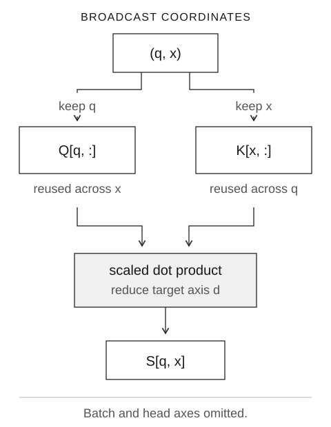
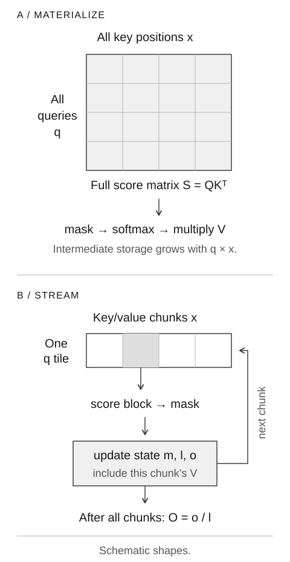
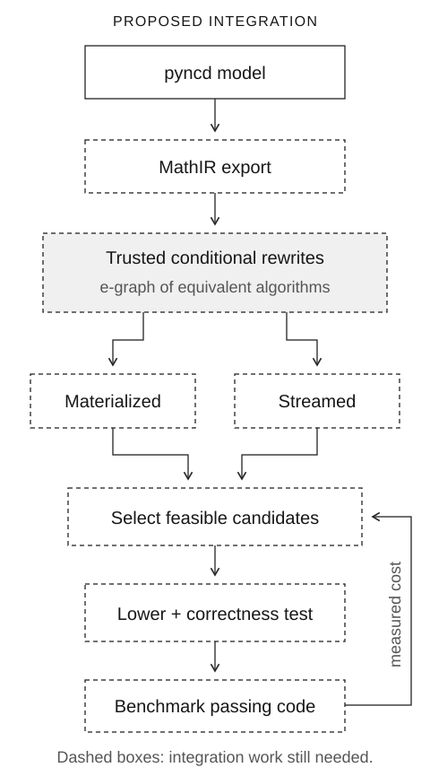

_Tensor indexing, online softmax, and compiler search_

An attention compiler must choose where to store intermediate values and how to divide the work across the GPU. Materializing the score matrix and streaming key/value blocks produce the same mathematical result, with different memory requirements. A compiler that can derive both algorithms has a larger search space than a tile-size autotuner.

Neural Circuit Diagrams describe tensor operations and their indexing. Equality saturation retains equivalent expressions so a compiler can compare their cost. Together, they could let a compiler search over attention algorithms.

I am considering an integration between [pyncd](https://github.com/mit-zardini-lab/pyncd) and EggEvolve, a kernel-search project. This post works through the indexing and streaming rules that integration would need. The export from pyncd, algorithm-level rewrites, and GPU lowering remain implementation work.

The examples assume familiarity with tensors, softmax, and the GPU memory hierarchy.

## 1. Reindexing and elementwise functions

Take a matrix $X$ and a pure, deterministic elementwise function $f$, such as squaring.

There are two ways to compute the same result:

$$
Y = \operatorname{transpose}(\operatorname{map}(f,X))
  = \operatorname{map}(f,\operatorname{transpose}(X)).
$$

At output coordinate $(i,j)$, both sides produce $f(X[j,i])$. This equality holds for any pure, deterministic elementwise function.

Let $\eta(i,j)=(j,i)$. Define reindexing by

$$
(\eta^*X)[p]=X[\eta(p)].
$$

The map runs from output coordinates back to input coordinates. A kernel uses the same direction to compute the source address for an output element.

More generally,

$$
\operatorname{map}_P(f,\eta^*X)
=
\eta^*\operatorname{map}_Q(f,X),
\qquad \eta:P\to Q.
$$

Here $P$ and $Q$ are index sets. Reindexing and pointwise computation commute.

A compiler can use this law to move a transpose through an activation and absorb it into a consumer's indexing. The performance depends on whether the backend implements the rearrangement as a view, fuses it into address calculation, or moves data.

Dropout violates the determinism assumption. Duplicating its output preserves the sampled mask in both copies; applying dropout independently to two copies of the input samples separate masks. Moving dropout across a reindexing that duplicates values can therefore change correlations.

Category theory provides a way to compose these laws. A morphism is a computation between typed input and output spaces. Composition connects compatible computations. A compiler can replace a term with an equal term inside a larger well-typed expression. [Weaves, Wires, and Morphisms](https://arxiv.org/abs/2604.07242) develops the array-broadcasted formulation behind pyncd.

## 2. Target and broadcast axes

Consider softmax on a tensor $X[B,S,H]$:

$$
Y[b,:,h]=\operatorname{softmax}(X[b,:,h]).
$$

The primitive is a vector function $f:\mathbb{R}^{S}\to\mathbb{R}^{S}$. It runs independently for every $(b,h)$.

| Axis | Role for this softmax | Consequence                                     |
| ---- | --------------------- | ----------------------------------------------- |
| $S$  | Target axis           | Entries participate in the same normalization.  |
| $B$  | Broadcast axis        | Different batches are independent applications. |
| $H$  | Broadcast axis        | Different heads are independent applications.   |

A _weave_ records the order of broadcast and target axes in a tensor. Here that order is broadcast–target–broadcast. The weave determines which subtensor one application of $f$ receives. GPU lane layouts and LDS swizzles are separate backend choices.

In pyncd, the `TILED` marker identifies broadcast-degree axes. The backend chooses GPU tile sizes and workgroup assignments later.

For an operation with several inputs, each input has its own access map. A simplified description is

$$
y[p]=f\bigl(x_1[\eta_1(p)],\ldots,x_k[\eta_k(p)]\bigr).
$$

The indexed values can be scalars or target subtensors. Access maps show which applications of the primitive reuse those values.

[Neural Circuit Diagrams](https://arxiv.org/abs/2402.05424) also distinguish separate tensor inputs from axes within a tensor. For example, passing Q and K to an operation preserves two input values; concatenation combines them into one tensor along a specified axis.

## 3. Attention access maps

Ignore batch and masking briefly. Let

$$
Q[q,h,d],\qquad K[x,h,d],\qquad V[x,h,d_v].
$$

With feature dimension $D_k$, the score operation is

$$
S[h,q,x]=\frac{1}{\sqrt{D_k}}\sum_{d=0}^{D_k-1} Q[q,h,d]K[x,h,d].
$$

The dot product reduces over $d$ and runs at each broadcast coordinate $(h,q,x)$, using the input access maps

$$
\eta_Q(h,q,x)=(q,h),\qquad
\eta_K(h,q,x)=(x,h).
$$

Q's map omits $x$, so a kernel can reuse a Q tile across keys. K's map omits $q$, which permits reuse across queries.

_Each score selects one query vector and one key vector. The dot product reduces over d; q and x enumerate independent scores._

Attention then normalizes along $x$ and contracts with V:

$$
P[h,q,:]=\operatorname{softmax}(S[h,q,:]),
\qquad
O[q,h,d_v]=\sum_x P[h,q,x]V[x,h,d_v].
$$

A kernel can assign independent query rows to separate workgroups. Each workgroup can then stream key/value blocks through an accumulator to compute the normalization and reduction.

_The materialized algorithm writes score/probability matrices. Streaming retains a query tile and online state while processing one key/value block at a time. This schematic omits batch/head axes and score scaling._

[FlashAttention on a Napkin](https://arxiv.org/abs/2412.03317) uses diagrams to derive tiling, streaming, and fusion strategies. Implementing those strategies requires the online-softmax recurrence and a reduction schedule that fits the hardware.

## 4. Online softmax

For one query, attention is a normalized weighted sum:

$$
O=\frac{\sum_i e^{s_i}v_i}{\sum_i e^{s_i}}.
$$

Maintain the following state for the scores processed so far:

$$
m=\max_i s_i,\qquad
\ell=\sum_i e^{s_i-m},\qquad
o=\sum_i e^{s_i-m}v_i.
$$

The output is $o/\ell$. An attention kernel stores a vector in $o$. This example uses scalar values to simplify the arithmetic.

When a new block $J$ arrives, update:

$$
\begin{aligned}
m' &= \max\left(m,\max_{j\in J}s_j\right),\\
\alpha &= e^{m-m'},\\
\ell' &= \alpha\ell+\sum_{j\in J}e^{s_j-m'},\\
o' &= \alpha o+\sum_{j\in J}e^{s_j-m'}v_j.
\end{aligned}
$$

Rescale the old sums to use the new maximum. Then add the new block's contributions.

Use scores $[0,1,2,3]$, values $[1,2,4,8]$, and blocks of two.

**First block.** Scores $[0,1]$ have maximum $m=1$:

$$
\ell=e^{-1}+1=1.367879,
\qquad
o=e^{-1}\cdot1+1\cdot2=2.367879.
$$

**Second block.** Scores $[2,3]$ raise the maximum to $m'=3$. Multiply the old summary by $\alpha=e^{-2}=0.135335$:

$$
\ell'=e^{-2}(e^{-1}+1)+(e^{-1}+1)=1.553002,
$$

$$
o'=e^{-2}(e^{-1}+2)+(4e^{-1}+8)=9.791975.
$$

| Scores processed | Maximum $m$ | Normalizer $\ell$ | Numerator $o$ | Current $o/\ell$ |
| ---------------- | ----------: | ----------------: | ------------: | ---------------: |
| $[0,1]$          |           1 |          1.367879 |      2.367879 |         1.731059 |
| $[0,1,2,3]$      |           3 |          1.553002 |      9.791975 |         6.305193 |

The direct result agrees:

$$
\frac{1+2e+4e^2+8e^3}{1+e+e^2+e^3}
\approx 6.305193.
$$

> **Interactive companion:** <a href="static/tensor-kernels/#online-softmax-demo" data-router-ignore>Step through the online-softmax recurrence</a>. The table above gives the values after each block.

The state retains the maximum and the unnormalized sums. Averaging the two blocks' softmax outputs would give each block equal weight, even though their exponential sums differ.

A GPU kernel loads a K/V block and computes a score tile. It updates the state and discards the tile. This avoids writing the full score/probability matrices to HBM. Dense attention still performs quadratic arithmetic.

The equations above describe real-number equality. For masked attention, exclude masked logits before computing each block's maximum and exponential contributions. Implementations also need rounding rules and defined behavior for empty or fully masked rows, where evaluating $-\infty-(-\infty)$ produces an undefined result.

## 5. Equality saturation

A conventional rewrite pass applies a transformation and continues with the modified program. The order matters. A rewrite that increases the cost at one step may allow a later rewrite to reduce it.

Over exact real arithmetic, consider

$$
a(b+c)-ab.
$$

Distributing multiplication temporarily makes the expression larger:

$$
ab+ac-ab.
$$

Cancel the two $ab$ terms to obtain $ac$. A rule that rejects every increase in expression size would miss this sequence.

An e-graph represents many equivalent expressions through shared structure. Equality saturation repeatedly applies trusted equalities while retaining alternatives. Extraction then chooses a representative according to a cost objective. An e-class groups terms that are equal under the supplied theory. Correctness depends on the validity of the rewrite rules and their conditions. The [egg paper](https://arxiv.org/abs/2004.03082) describes the data structure, rebuilding, and e-class analyses.

For attention, alternatives might include materialized, tiled-unfused, and fused-streaming algorithms. Proving their equivalence requires an accumulator invariant for the streaming update.

Rewrites can grow the e-graph rapidly. The compiler must limit memory use and choose which rules to apply. Extraction also needs a hardware cost model. Fusion can lower HBM traffic while increasing live registers enough to cause spills. The compiler can retain several feasible candidates and measure their performance.

## 6. A proposed pyncd and EggEvolve integration

I would use pyncd to describe the computation and EggEvolve to search and evaluate implementations. The interface would need representations for the mathematical function, algorithm choices, and GPU execution:

| Level     | Question answered                | Representative constructs                               |
| --------- | -------------------------------- | ------------------------------------------------------- |
| MathIR    | What function must be preserved? | Broadcast, reindex, contraction, normalization          |
| AlgIR     | Which algorithm computes it?     | Materialize, tile, fuse, stream, recompute              |
| BackendIR | How does the GPU execute it?     | Waves, lanes, LDS layout, instructions, pipeline stages |

These IRs would be new interfaces in the proposed integration.

An export from pyncd would give MathIR canonical axes, access maps, primitives, and shared dataflow. AlgIR would record algorithm choices and the conditions under which each choice preserves the function. A streaming rewrite, for example, should require a registered state-update law and preserve masks and output indexing.

_Proposed compiler flow. An export from pyncd feeds a typed algorithm IR. Candidate algorithms pass through extraction, lowering, correctness tests, and benchmarking. Dashed boxes mark work still needed._

The compiler would extract candidates and reject schedules that exceed hardware resources. It would lower the remaining candidates, compare their outputs with a reference, and benchmark those that pass. Measurements would calibrate the cost model. The rewrite rules would determine which expressions the e-graph can merge.

A first backend could use a few structured Triton templates. Another option is MLIR Linalg, whose iteration spaces and affine indexing maps support tiling, fusion, promotion, and further lowering. A pyncd export could feed this existing compiler infrastructure. See the [MLIR Linalg documentation](https://mlir.llvm.org/docs/Dialects/Linalg/) for its representation and transformations.

### K/V reuse in grouped-query attention

In grouped-query attention (GQA), several query heads share one key/value head. Suppose $H_q=G H_{kv}$. With contiguous head grouping, $h_q=h_{kv}G+g$. Factor the query-head axis as $(h_{kv},g)$:

$$
Q[b,q,h_{kv},g,d],\quad
K[b,x,h_{kv},d],\quad
V[b,x,h_{kv},d_v].
$$

The K/V access maps omit $g$: all query heads in a group access the same K/V head. Factoring the head axis makes this sharing explicit as a projection.

For a different head order, apply an explicit permutation. The backend must arrange loads and storage to reuse the shared K/V data.

Processing more query heads together increases K/V reuse and the amount of live query/output state. The backend can search over group sizes to find how much sharing fits the target's resources.

An LLM could propose tile choices, rewrite schedules, or algorithm sketches. The compiler would check each proposed equality against the registered rules before merging the expressions.

## 7. Numerical equivalence

Real-number algebra, floating-point execution, and model-quality preservation are different contracts.

Reassociating a sum is valid over reals but can change floating-point results. Quantization changes represented values. Replacing softmax with a different normalization changes the model function. An e-class that requires bitwise equality must reject these changes unless a rule proves that they preserve the bits for the given inputs.

A low-level rewrite must update every affected operation. When padding GEMM dimensions, mask the loads and crop the output. When changing an LDS stride, update the allocation and both producer and consumer address maps. Check these conditions even if the code compiles.

A first prototype could fix the shapes and dtypes and use deterministic inference with explicit masks. Document absolute and relative output tolerances. Tests should cover awkward dimensions, extreme logits, and masked rows as well as random inputs.

Tolerance-based closeness is not transitive: A can be close to B, and B close to C, while A is not close to C. It therefore cannot justify ordinary e-class merging. Keep approximate candidates separate and compare each against a fixed reference or maintain explicit error bounds.

A proof establishes that a high-level rewrite preserves the function. Validate lowering and code generation separately.

## 8. Prototype scope

Start with one forward GQA operation on one AMD target. Export its pyncd meaning into a typed IR. Add a small set of rules for reindexing, tiling, fusion, and one online-softmax accumulator. Produce materialized and streamed candidates, then compile, compare, and time them.

This would test whether the representation and rewrite rules can generate both algorithms from one mathematical input. Correctness tests and timings would show whether the generated kernels meet the numerical contract and how their performance compares. Those results would guide work on additional operators and targets.

## Exercises

What would break if softmax were moved across an arbitrary reshape as though it were elementwise?

The reshape may change which elements share a normalization group. The map/reindex law requires the rewrite to preserve the primitive's target groups.

Why must the first block's state be rescaled when a larger score arrives?

The old sums use the previous maximum. Multiply both sums by the rescaling factor to express them relative to the new maximum. Their ratio stays the same.

What does factoring the GQA head axis reveal, and what does it leave undecided?

K/V accesses are invariant over the group coordinate. The backend must still choose data placement, wave mapping, and how many query heads to process together.

Why can fewer HBM bytes still produce a slower extracted kernel?

The schedule may increase register pressure, spills, synchronization, redundant computation, or occupancy loss. The cost model must account for these costs as well as memory traffic.

## Glossary

| Term                | Meaning here                                                      |
| ------------------- | ----------------------------------------------------------------- |
| Morphism            | A typed computation that can compose with other computations.     |
| Reindexing          | Selecting input coordinates through an output-to-input map.       |
| Broadcast degree    | The index space over independent applications of a primitive.     |
| Weave               | The interleaving of broadcast axes and primitive-target axes.     |
| Denotation          | The mathematical meaning of an expression or algorithm.           |
| E-class             | Expressions treated as equivalent under registered rules.         |
| Equality saturation | Applying equalities while retaining alternative expressions.      |
| Extraction          | Selecting an implementable representative using a cost objective. |

## Implementation scope

At [pyncd `13c1de0`](https://github.com/mit-zardini-lab/pyncd/tree/13c1de0296120e07b959d4de23e4d1151abeb8d8), the documented pieces include algebraic terms, symbolic axes, graph conversion, serialization, rendering support, and conversion to PyTorch modules. This is the semantic foundation for the proposal; the algorithm-search layer and Triton/MLIR lowering described here are additional work.

The proposed integration still needs an implementation and benchmarks.

## References

1. [Neural Circuit Diagrams](https://arxiv.org/abs/2402.05424): Tensor axes, separate values, and broadcast operations.
2. [Weaves, Wires, and Morphisms](https://arxiv.org/abs/2604.07242): The formal treatment of index maps, weaves, and compositional model terms.
3. [FlashAttention on a Napkin](https://arxiv.org/abs/2412.03317): IO-aware tiling and streaming, also covered in the accompanying [GPU MODE talk](https://www.youtube.com/watch?v=hAoY2bpRIKg).
4. [egg: Fast and Extensible Equality Saturation](https://arxiv.org/abs/2004.03082): E-graphs, rebuilding, and domain analyses.
5. [MLIR Linalg](https://mlir.llvm.org/docs/Dialects/Linalg/): Structured operations and compiler transformations.
6. [pyncd source and examples](https://github.com/mit-zardini-lab/pyncd): Term construction, graph conversion, and PyTorch execution.

## Related posts

- [Triton Linear Layouts](2025-06-22-linear-layouts.md): mapping logical tensor coordinates to GPU execution.
- [CuTe Basics](2025-05-10-cute-basics.md): layouts, tensors, and composition.

_The diagrams are original schematics. The worked example uses double-precision arithmetic._
